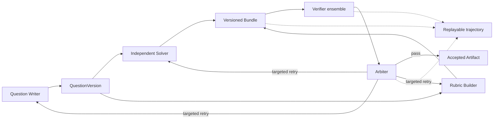

# Assessment Workbench

> Verifier-centric multi-agent evaluation, structured feedback, and replayable trajectories for RLVR and Agentic RL research.

[中文](README.md) · [Technical report (Chinese)](REPORT.md) · [Architecture](docs/architecture.md)

[](https://www.python.org/)
[](https://fastapi.tiangolo.com/)
[](frontend/)
[](LICENSE)

Assessment Workbench turns assessment generation into a verifiable multi-agent environment. A Writer proposes questions, an Independent Solver derives answers, a Rubric Builder defines scoring contracts, specialist Reviewers form a verifier ensemble, and an Arbiter converts structured findings into acceptance, targeted retry, or human escalation.

The system does not treat one prompt response as ground truth. Questions, solutions, rubrics, review reports, transitions, failures, retries, and checkpoints are versioned for offline evaluation, trajectory replay, and future Reward / RLVR experiments.

## At a Glance

| Implemented capability | Evidence in this repository |
| --- | --- |
| Public process evaluation | Full 400-case ProcessBench GSM8K split, Oracle-blind observations, and offline report |
| Multi-agent generation | Writer, Solver, Rubric Builder, five LLM reviewer roles, deterministic checks, and Arbiter |
| Resumable execution | Incremental observations, checkpoints, targeted retry, and isolated child runs |
| Visual workbench | React UI for questions, stages, events, documents, and publication state |
| Publishable artifacts | A 19-question, 150-point exam with 34 PDF pages across questions, solutions, and rubrics |
| RLVR export surface | Versioned observations, reward candidates, and episode / preference JSONL |



Architecture, state machines, agent interaction, and reward-candidate definitions are kept in [REPORT.md](REPORT.md). This README focuses on the project and concrete cases.

## ProcessBench: Real Process-Verification Results

[ProcessBench](https://huggingface.co/datasets/Qwen/ProcessBench) asks a verifier to decide whether a mathematical solution is correct and, when it is not, locate the **first incorrect step**. This exposes failures that final-answer checking cannot see, especially trajectories whose answer is correct by luck.

Setup: full 400-case GSM8K split; `gemini-3.5-flash`; temperature 0; one trial; the prompt excludes the Oracle `first_error_step` and `final_answer_correct` fields.

| Metric | Gemini Flash |
| --- | ---: |
| Cases | **400** |
| Exact first-error match | **364 / 400 = 91.0%** |
| Error-process detection recall | **203 / 207 = 98.1%** |
| Error-process exact localization | **174 / 207 = 84.1%** |
| Correct-process acceptance | **190 / 193 = 98.4%** |
| Correct-final-answer trap localization | **3 / 7 = 42.9%** |

Raw evidence:

- [400 public cases](examples/processbench-gsm8k/cases.full.jsonl)
- [Raw Gemini Flash observations](examples/processbench-gsm8k/observations.gemini-flash.full.jsonl)
- [Full offline report](examples/processbench-gsm8k/report.gemini-flash.full.json)
- [Experiment notes and reproduction commands](examples/processbench-gsm8k/README.md)

The aggregate score is strong, but the failure structure matters: the model misses only four erroneous processes, yet assigns the wrong first-error location to another 29. It also precisely localizes only three of seven lucky-answer traps. **Detecting that something is wrong is substantially easier than identifying where it first becomes wrong**, and a correct final answer still masks local semantic errors.

The following cases show one success and one failure from the same verifier. Both are public benchmark records, not hand-written demo fixtures.

## Case 1: A Standard Reasoning Error Is Localized

**ProcessBench ID:** `gsm8k-0`; **candidate generator:** `Qwen2-7B-Instruct`

**Problem**

Sue's lawn starts with 18 pink plastic flamingos. On Saturday, one third are taken away, painted white, and returned. On Sunday, another 18 pink flamingos are added. How many more pink than white flamingos are there at noon on Sunday?

**Candidate solution**

1. Friday starts with 18 pink flamingos.
2. Six are repainted, so there should be 12 pink and 6 white, but the candidate then states:

   > “Thus, by the end of Saturday, Sue has `12 + 6 = 18` pink flamingos and 6 white flamingos.”

3. It carries the invalid state forward and computes `18 + 18 = 36` pink flamingos.
4. It returns `36 - 6 = 30`.

**What is wrong**

`12 + 6 = 18` is the total number of flamingos, not the pink count. Saturday should end with 12 pink and 6 white; Sunday should have 30 pink and 6 white, so the correct difference is 24.

| | First error step | Confidence | Result |
| --- | ---: | ---: | --- |
| ProcessBench Oracle | 1 | - | Candidate process is wrong |
| Gemini Flash | 1 | 1.0 | **Correct localization** |

Gemini explicitly says the candidate mistook the total count of 18 for the pink count, so it identifies the first error instead of relying only on the wrong final answer.

## Case 2: A Correct Final Answer Masks a Process Error

**ProcessBench ID:** `gsm8k-290`; **candidate generator:** `Qwen2-1.5B-Instruct`

**Problem**

Zack's locker is half as big as Timothy's. Peter's locker is one quarter as big as Zack's. If Peter's locker is 5 cubic inches, how big is Timothy's?

**Candidate solution**

1. It computes `5 ÷ (1/4) = 20`, correctly obtaining Zack's volume, but the same sentence says:

   > “Zack's locker (which is **twice as big**) would be ... `5 × 4 = 20`.”

2. It then computes `20 × 2 = 40`, reaching the correct final answer.

**What is wrong**

If Peter is one quarter of Zack, Zack is **four times** Peter, not twice Peter. The formula multiplies by four while the natural-language claim says two. ProcessBench therefore labels step 0 as incorrect even though the final answer happens to be correct.

| | First error step | Confidence | Result |
| --- | ---: | ---: | --- |
| ProcessBench Oracle | 0 | - | Candidate process is wrong |
| Gemini Flash | -1 | 1.0 | **Missed; accepted as fully correct** |

Gemini's raw rationale says:

> “Both steps are mathematically and logically correct ... The steps are entirely accurate.”

It follows the correct arithmetic and final answer without checking whether “twice” agrees with `×4`. This is a concrete process-reward exploitation surface: a trajectory receives a high-confidence pass while retaining an invalid reasoning statement.

## Web Workbench

The local React workbench shows a completed run rather than only the final PDF. The question workspace supports per-question inspection, editing, rerun, and publication.


The document workspace manages question, solution, and rubric views with build status, page counts, embedded PDF previews, and downloads.


The overview retains stage history, recovery events, child runs, and completion counts.


| Signal from the captured run | Observed value |
| --- | ---: |
| Completed questions | **19 / 19** |
| Parallel subject-research roles | **3** |
| Published document views | **3 / 3** |
| Stage events | **59** |
| Isolated child runs | **65** |

## Published Exam Artifacts

The repository retains a real generated and published 19-question, 150-point Gaokao mathematics mock exam.

<table>
  <tr>
    <td width="33%" align="center"><strong>Questions</strong></td>
    <td width="33%" align="center"><strong>Solutions</strong></td>
    <td width="33%" align="center"><strong>Rubric</strong></td>
  </tr>
  <tr>
    <td></td>
    <td></td>
    <td></td>
  </tr>
</table>

| Artifact check | Result |
| --- | ---: |
| Questions / points | 19 / 150 |
| PDF pages | 5 + 16 + 13 = **34** |
| Full-page render checks | **3 / 3 passed** |
| Blocking render issues | **0** |
| Slowest parallel document build | **24.2 s** |

[Download questions](examples/gaokao-mathematics/artifacts/exam-questions.pdf) · [Download solutions](examples/gaokao-mathematics/artifacts/exam-solutions.pdf) · [Download rubric](examples/gaokao-mathematics/artifacts/exam-rubric.pdf)

These artifacts demonstrate workflow completion, version binding, artifact integrity, and rendering quality. The complete exam has not been independently graded by a mathematics expert.

## Quick Start

```bash
git clone git@github.com:kyc001/assessment-workbench.git
cd assessment-workbench
uv sync
cp .env.example .env

uv run assessment-workbench workspace init ./workspaces/demo
uv run assessment-workbench gui --workspace ./workspaces/demo
```

Generate a complete exam:

```bash
uv run assessment-workbench exams generate \
  --subject "Gaokao Mathematics" \
  --target-level "High school graduation" \
  --requirements "19 questions, 150 points, standard mock exam" \
  --workspace ./workspaces/demo
```

Run the resumable ProcessBench verifier:

```bash
uv run assessment-workbench benchmark observe-process \
  --cases examples/processbench-gsm8k/cases.full.jsonl \
  --output examples/processbench-gsm8k/observations.gemini-flash.full.jsonl \
  --verifier gemini_flash \
  --model gemini-3.5-flash \
  --trial 1 \
  --concurrency 1 \
  --request-delay 10 \
  --workspace workspaces/processbench-gemini

uv run assessment-workbench benchmark report-process \
  --cases examples/processbench-gsm8k/cases.full.jsonl \
  --observations examples/processbench-gsm8k/observations.gemini-flash.full.jsonl \
  --verifier gemini_flash \
  --trial 1 \
  --output examples/processbench-gsm8k/report.gemini-flash.full.json
```

## Repository Map

```text
src/assessment_workbench/   Domain models, workflows, agents, verifiers, storage
frontend/                   Local React workbench
tests/                      Offline unit and integration tests
examples/processbench-gsm8k/Public benchmark cases, observations, and report
examples/gaokao-mathematics/Published exam artifacts
docs/                       Architecture and implementation notes
```

See [REPORT.md](REPORT.md) for the research and system design, and [docs/architecture.md](docs/architecture.md) for implementation-level architecture.

## Evidence Boundary

The project can currently claim verifier-centric multi-agent evaluation, structured feedback, resumable execution, public process benchmarking, and replayable trajectory infrastructure.

It cannot yet claim completed RL training, improved reward models, a causal reduction in reward hacking, or superiority over a matched-budget single-agent baseline. Those claims require multi-model and multi-trial evaluation, expert-validated attacks, and controlled comparisons.

## License

[Apache-2.0](LICENSE)
