# Assessment Workbench

> Verifier-centric multi-agent evaluation, structured reward candidates, and replayable trajectories for assessment generation.

[中文文档](README.zh-CN.md)

[](https://www.python.org/)
[](https://fastapi.tiangolo.com/)
[](frontend/)
[](LICENSE)

Assessment Workbench investigates a practical systems question: **how can a multi-agent generation process expose reliable verification signals, structured feedback, and replayable trajectories instead of collapsing into one opaque prompt?**

Assessment generation is the concrete environment: a Writer proposes questions, an Independent Solver derives answers, a Rubric Builder defines scoring contracts, specialized Reviewers act as a verifier ensemble, and an Arbiter turns verifier disagreement into targeted revision actions. The runtime records every version, finding, action, failure, retry, and checkpoint as an auditable trajectory.

The current project is best described as **evaluation, feedback, and trajectory infrastructure for future RLVR and Agentic RL experiments**. It does not yet train a policy, optimize a reward model, or claim measured resistance to reward hacking.

## Verifier-Centric Research Framing

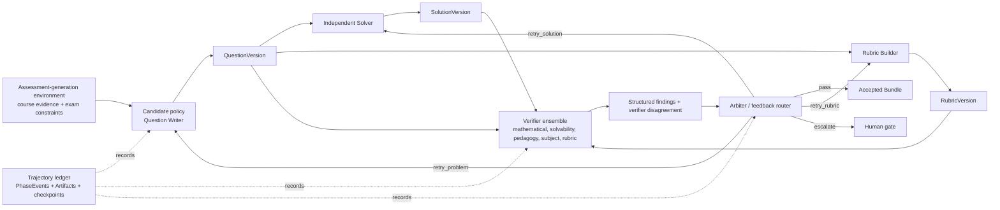

This framing exposes several research objects that a conventional exam generator does not preserve:

- **verifier outputs:** pass/fail, severity, finding code, target, rationale, and evidence;
- **verifier disagreement:** conflicting reports over the same immutable content versions;
- **process supervision:** which role failed, what feedback was issued, and which local action followed;
- **reward candidates:** deterministic validity signals and structured verifier judgments that can later be calibrated into rewards;
- **replayable trajectories:** exact inputs, outputs, versions, model-call metadata, state transitions, and recovery events;
- **counterfactual repair points:** problem, solution, rubric, question plan, section, or full-run boundaries.

## Workbench

The local React workbench exposes the complete run instead of hiding it behind a final PDF. A completed 19-question run can be inspected question by question, edited, rerun, and published from the same interface.


The document workspace keeps the student paper, worked solutions, and scoring rubric together, with page counts, build status, inline PDF preview, and direct downloads.


The overview retains phase history, recovery events, child-run states, and final completion counters for audit and debugging.


| UI acceptance-run signal | Observed value |
| --- | ---: |
| Completed questions | **19 / 19** |
| Parallel subject-research roles | **3** |
| Published document views | **3 / 3** |
| Recorded phase events | **59** |
| Isolated child runs | **65** |

The interface screenshots use a completed dynamic discrete-mathematics workspace. The downloadable release below is a separate Gaokao mathematics case study. Both are preserved local acceptance runs, not mocked UI data.

## Verified Demo

The repository includes a real end-to-end release produced by the workbench: a 19-question, 150-point Chinese Gaokao mathematics mock exam.

<table>
  <tr>
    <td width="33%" align="center"><strong>Student paper</strong></td>
    <td width="33%" align="center"><strong>Worked solutions</strong></td>
    <td width="33%" align="center"><strong>Scoring rubric</strong></td>
  </tr>
  <tr>
    <td></td>
    <td></td>
    <td></td>
  </tr>
</table>

| Verified property | Observed result |
| --- | ---: |
| Questions / total score | 19 / 150 |
| Published views | student paper, solutions, rubric |
| Rendered pages | 5 + 16 + 13 = **34** |
| Full-page render inspections | **3 / 3 passed** |
| Blocking render findings | **0** |
| Slowest parallel document build | **24.2 s** |
| Release status | document gate approved |

Download the actual artifacts:

- [Student paper](examples/gaokao-mathematics/artifacts/exam-questions.pdf)
- [Worked solutions](examples/gaokao-mathematics/artifacts/exam-solutions.pdf)
- [Scoring rubric](examples/gaokao-mathematics/artifacts/exam-rubric.pdf)
- [Demo provenance and limitations](examples/gaokao-mathematics/README.md)

These are acceptance-run measurements, not a multi-seed benchmark. Mathematical correctness has not yet been independently expert-rated; the current evidence establishes workflow completion, artifact integrity, and render quality.

## Design Principles

1. **Reasoning is separated from control.** Agents propose typed outputs; the runtime decides whether those outputs can advance the workflow.
2. **JSON domain objects are the source of truth.** Markdown, LaTeX, PDF, logs, and page images are rebuildable projections.
3. **Every expensive stage has an Artifact boundary.** A completed stage can be reused without repeating its model call.
4. **Failures are localized.** Questions, reviewers, and document views run as isolated children with independent retry histories.
5. **Review is independent and version-bound.** A report is reusable only when its question, solution, and rubric version IDs still match.
6. **Human gates are explicit state transitions.** Approval, edit-acceptance, retry, rejection, and abort are recorded as decisions.
7. **Provider details stay behind ports.** The domain layer does not depend on a specific model provider, Agent framework, parser, vector database, or RAG product.

## System Architecture

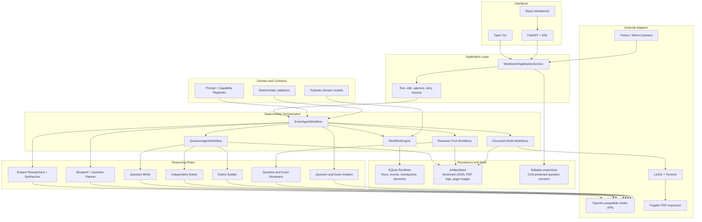

The architecture deliberately avoids making an Agent framework the system of record. Agent outputs become useful only after they validate against domain contracts and are committed as versioned Artifacts.

## Run Hierarchy

One exam is a tree of independently observable runs rather than a single long coroutine.

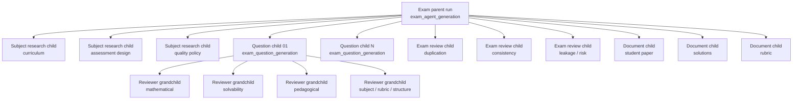

This hierarchy provides separate status, events, checkpoints, attempts, and Artifacts for each expensive unit of work. A failed reviewer does not erase successful sibling reports; a failed PDF view does not invalidate the other two views.

## End-to-End Exam Workflow

The parent workflow uses 15 named phases. Dynamic subjects execute the research branch; explicit presets and registered capabilities may reuse locked structures while still entering the same downstream pipeline.

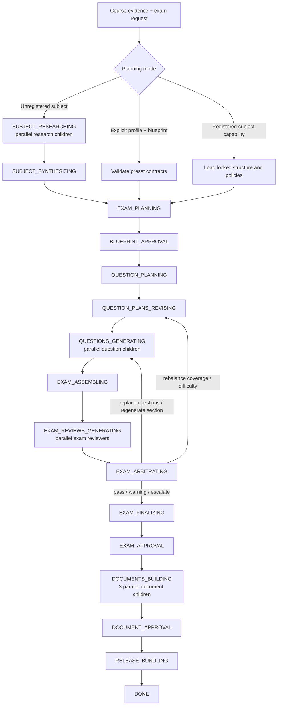

## Agent Interaction

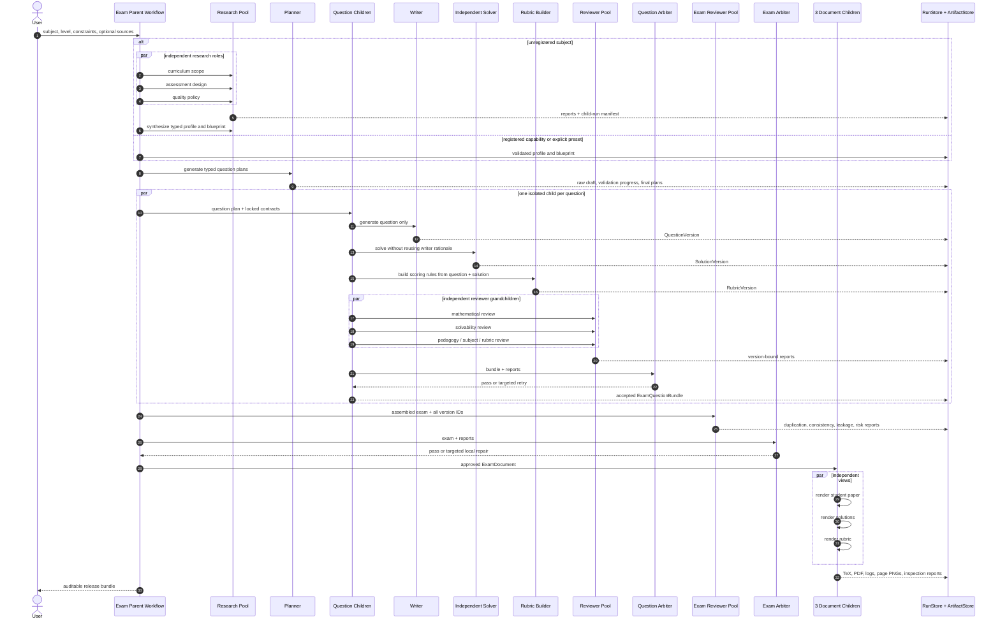

The Writer, Solver, and Rubric Builder do not share an unconstrained conversational transcript. They communicate through typed, versioned domain objects. Reviewers bind to exact version IDs, which prevents a report from being silently reused after an edit.

## Structured Feedback and Reward Candidates

The system does not currently collapse evaluation into one scalar reward. It preserves a richer signal vector that can be replayed, audited, and calibrated later.

| Signal family | Existing source | Example interpretation |
| --- | --- | --- |
| Contract validity | Pydantic and deterministic validators | hard negative when required fields, score totals, slot contracts, or version bindings fail |
| Independent solution evidence | `SolutionVersion` plus solvability/mathematical reviews | semantic correctness candidate independent of Writer self-evaluation |
| Rubric consistency | `RubricVersion` plus rubric Reviewer | whether scoring rules agree with the question and reference solution |
| Verifier ensemble | version-bound `ReviewReport` objects | pass/fail vector, severity distribution, finding codes, target-specific feedback |
| Verifier disagreement | reports over the same Bundle signature | uncertainty signal or trigger for stronger verification / human review |
| Arbitration action | `PASS`, targeted retry, escalation, or abort | structured process-level supervision rather than free-text critique alone |
| Whole-exam checks | coverage, difficulty, duplication, leakage, consistency | global constraint reward candidates unavailable at single-question scope |
| Reliability signals | retries, interruptions, recovery events, duplicate calls | efficiency and robustness penalties for Agentic RL environments |
| Publication gates | compile status, page inspection, human acceptance | executable final-state validity signal |

A future experiment can derive a calibrated reward without discarding the original evidence, for example:

```text
reward_candidate =
    contract_validity
  + independent_solution_score
  + rubric_consistency
  + verifier_consensus
  + coverage_gain
  - blocking_findings
  - duplicate_penalty
  - recovery_cost
```

This expression is a proposed research interface, not a currently trained reward model. The repository stores the components needed to test alternative weighting, aggregation, disagreement handling, and anti-hacking rules offline.

## Workflow Run State Machine

`WorkflowRun.status` is validated against an explicit transition table.

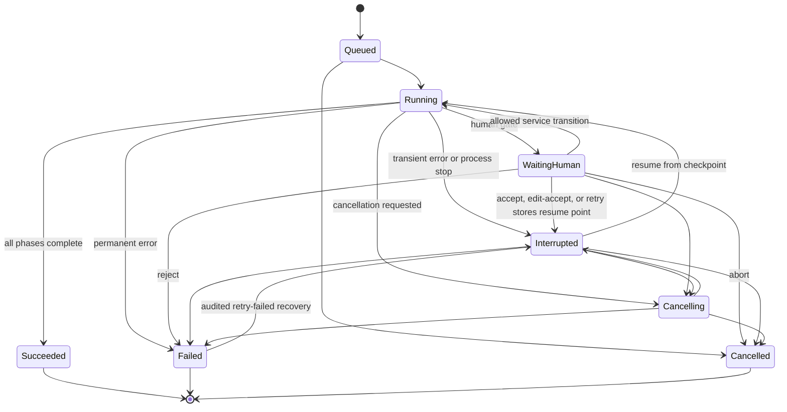

Each named phase emits a paired `running` and `completed` event sharing an occurrence ID. Failures emit a `failed` event with an error code and details. The event round increases whenever the same phase is re-entered.

## Question State Machine and Local Retry

Every question has its own run, persistent `QuestionWorkflowState`, retry counters, and version chain.

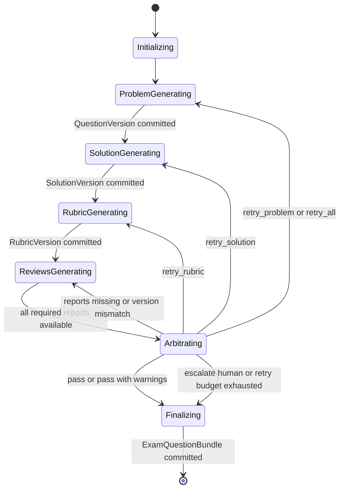

Arbitration feedback is routed only to the responsible role. Retrying a solution keeps the accepted question version; retrying a rubric keeps both question and solution versions. Exhausted local budgets finalize the latest Bundle with `requires_human_review=true` instead of looping indefinitely.

## Whole-Exam Review and Repair

Question-level validity is necessary but not sufficient. The assembled exam is checked for cross-question properties and can repair only the affected region.

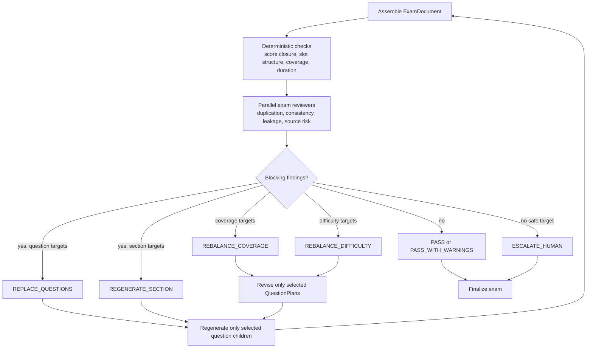

Replacement history preserves the old child-run pointer and Bundle. Non-target questions remain unchanged. Review reports are invalidated whenever any bound question, solution, or rubric version changes.

## Checkpoint and Recovery Design

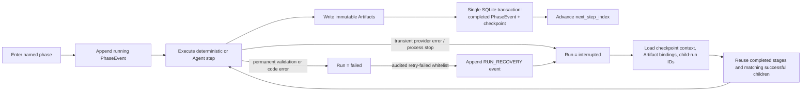

`WorkflowCheckpoint` stores the next step index, scalar context, Artifact bindings, child-run IDs, and the latest human decision ID. Large typed objects are restored from Artifact IDs rather than serialized into the checkpoint.

The completed phase event and checkpoint are committed in one SQLite transaction. Artifact files and SQLite are different transaction domains, so publication uses recoverable write-and-bind semantics rather than claiming cross-media ACID.

## Replayable Trajectories for Agentic RL

The runtime records enough structure to reconstruct an Agent episode without relying on a single concatenated chat log.

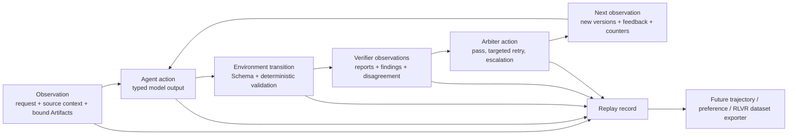

An episode can include:

- the exact Prompt version, response Schema hash, ContextPack hash, request hash sequence, and response hash;
- typed observations referencing immutable input Artifact versions;
- Agent outputs and deterministic validation failures;
- parallel verifier reports and their completion order;
- Arbiter decisions, role-specific feedback, and targeted retry actions;
- checkpoint boundaries, interruption/recovery events, latency, and token usage;
- final Bundle and publication-gate outcome.

Today these records support audit, resume, and local replay. A dedicated dataset exporter and policy-training loop are future work; the infrastructure should therefore be described as **Agentic RL-ready trajectory infrastructure**, not as a completed Agentic RL system.

## Document Build and Publication

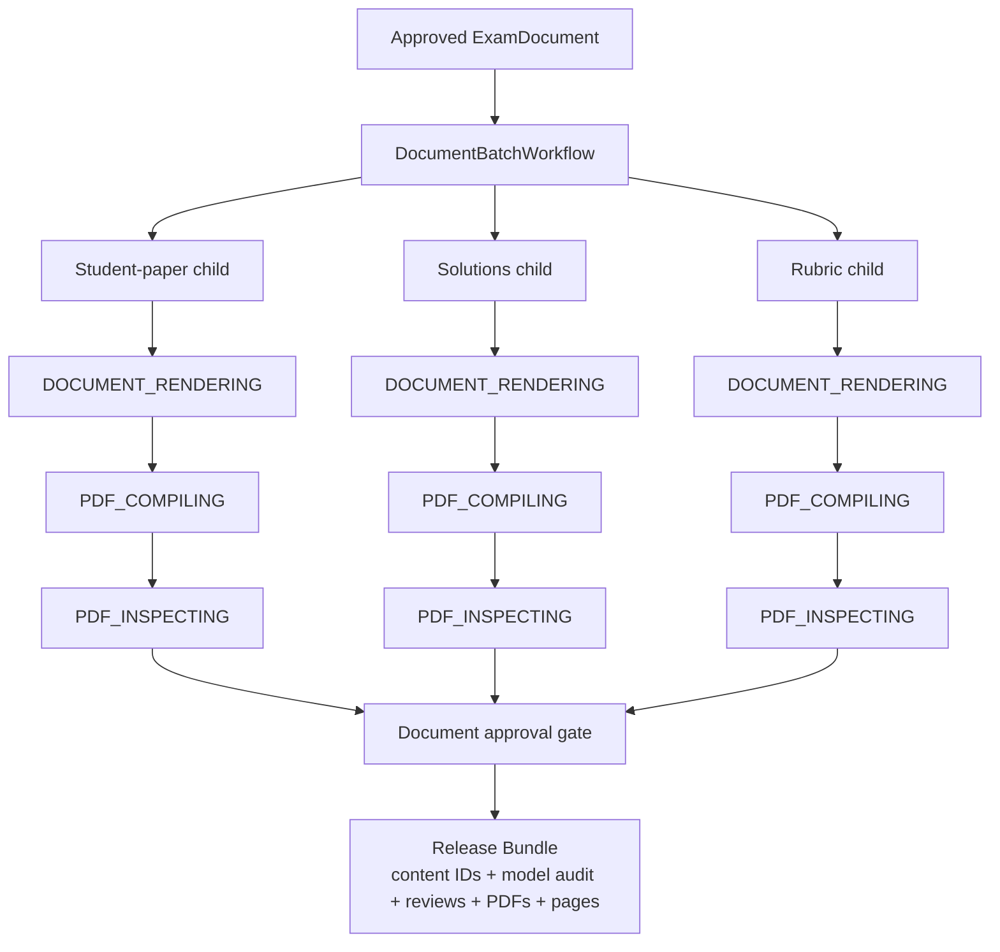

Each view independently produces LaTeX source, compiler log, PDF, page PNGs, and a machine-readable inspection report. Page inspection checks text extraction, ink ratios, edge content, empty pages, and blocking render findings. Only failed views need rebuilding.

## Planning Modes and Registries

Planning resolution uses the following priority:

1. explicit `SubjectProfile` and `ExamBlueprint` supplied by the caller;
2. a registered `SubjectCapability` such as the 19-question Gaokao mathematics structure;
3. dynamic subject research and synthesis for unregistered subjects.

```text
PromptRegistry
  -> PromptBundle(key, role, version, system_prompt)

CapabilityCatalog
  -> ReviewerRegistry
  -> SubjectResearchRegistry
  -> ToolRegistry
  -> ValidatorRegistry
  -> SubjectCapabilityRegistry
```

Capabilities lock structure and policies, not static questions. Prompt versions, capability IDs, validator names, model roles, request hashes, response hashes, token usage, and provider request IDs are written into the audit trail.

## Artifact and Audit Model

| Record | Purpose |
| --- | --- |
| `WorkflowRun` | Current workflow status, phase, owner process, error |
| `PhaseEvent` | Immutable phase occurrence with parent linkage, inputs, outputs, timing, warnings, and errors |
| `WorkflowCheckpoint` | Resume index plus Artifact and child-run bindings |
| `ArtifactRef` | Versioned logical name, path, media type, SHA-256, size, producing phase |
| `ModelCall` | Role, model, prompt version, schema/context hashes, request sequence, usage, provider metadata |
| `HumanReviewRequest` | Gate prompt, allowed decisions, resume phase, retry phase, bound Artifacts |
| `HumanDecision` | Actor, decision, reason, input Artifact IDs, timestamp |
| `QuestionVersion` / `SolutionVersion` / `RubricVersion` | Independently versioned assessment content with parent-version links |
| `ReviewerRunRecord` | Reviewer attempt bound to exact content version IDs |
| `ReleaseBundle` | Final content signature, run graph, model audit, reviews, arbitration, documents, logs, pages, acceptance |

## Quick Start

```bash
git clone git@github.com:kyc001/assessment-workbench.git
cd assessment-workbench
uv sync
cp .env.example .env

uv run assessment-workbench workspace init ./workspaces/demo
uv run assessment-workbench gui --workspace ./workspaces/demo
```

Generate a full exam:

```bash
uv run assessment-workbench exams generate \
  --subject "高考数学" \
  --target-level "高中毕业年级" \
  --requirements "19 题，150 分，标准模拟卷" \
  --workspace ./workspaces/demo
```

Human-gated runs pause before release:

```bash
uv run assessment-workbench runs approve <run-id> --workspace ./workspaces/demo
uv run assessment-workbench runs resume <run-id> --workspace ./workspaces/demo
```

Resume a transiently interrupted run:

```bash
uv run assessment-workbench runs resume <run-id> --workspace ./workspaces/demo
```

## Repository Map

```text
src/assessment_workbench/
  domain.py                    typed domain models and transition contracts
  workflow.py                  generic checkpointed workflow engine
  agents.py                    parent exam orchestration
  question_workflow.py         Writer / Solver / Rubric / review / arbitration loop
  review_workflow.py           isolated question reviewer children
  exam_review_workflow.py      isolated whole-exam reviewer children
  exam_workflow.py             exam-level review gates and targeted repair routing
  document_workflow.py         LaTeX, PDF compilation, inspection, page Artifacts
  storage.py                   SQLite RunStore and filesystem ArtifactStore
  web_api.py                   typed local HTTP and SSE interface

frontend/                      React local workbench
tests/                         offline unit and integration tests
examples/                      constraints and published demo artifacts
docs/                          architecture and implementation notes
```

Further reading:

- [Architecture notes](docs/architecture.md)
- [Gaokao demo](examples/gaokao-mathematics/README.md)
- [Implementation status](docs/IMPLEMENTATION_PLAN.md)

## Reward-Hacking Threat Model

Assessment generation is useful for verifier research because outputs can appear structurally correct while exploiting weaknesses in semantic checks or scoring rules.

| Attack family | Adversarial candidate | Expected defense signal |
| --- | --- | --- |
| Format compliance without semantic validity | valid JSON and polished LaTeX, but ambiguous or unsolvable question | independent Solver failure, solvability findings |
| Lucky final answer | correct final value with invalid reasoning | mathematical Reviewer checks steps, not only answer string |
| Self-consistent fabrication | Writer, solution, and rubric repeat the same false premise | role isolation plus subject/mathematical verification |
| Rubric gaming | answer exploits missing scoring conditions or receives points without required reasoning | rubric consistency and adversarial scoring review |
| Verifier persuasion | verbose rationale attempts to override blocking evidence | deterministic gate forbids `PASS` while error/fatal findings remain |
| Citation laundering | plausible source claim without matching source block | source-reference and grounding validation |
| Duplicate camouflage | superficial wording changes hide repeated constructions | whole-exam duplication review over the assembled exam |
| Difficulty gaming | trivial or impossible questions satisfy nominal metadata | solver-based calibration and whole-exam difficulty checks |
| Recovery exploitation | retries mutate unrelated accepted content or replay expensive calls | immutable versions, target resolution, checkpoint and replacement history |

The infrastructure already records the evidence needed to measure attack success, verifier recall, false positives, disagreement, and repair cost. It does **not** yet include a published adversarial benchmark or a measured reduction in reward-hacking attack success rate.

## RLVR and Reward-Hacking Evaluation Roadmap

The highest-value next experiment is a controlled verifier and adversarial-evaluation pilot:

1. Freeze course evidence, model versions, schemas, prompts, budgets, and random seeds.
2. Build clean and adversarial response pairs covering format-valid/semantically-wrong answers, lucky answers with invalid reasoning, shared false premises, and rubric loopholes.
3. Compare deterministic checks, individual Verifiers, verifier ensembles, and Arbiter-gated decisions.
4. Report attack success rate, verifier recall/precision, disagreement rate, false-rejection rate, repair success, and cost per accepted valid question.
5. Replay the same trajectories under alternative reward aggregation rules without repeating model generation.
6. Compare Single Agent, Fixed Pipeline, and the role-separated workflow under equal-budget and natural-run settings.

Only after this experiment should the project claim statements such as “reduced reward-hacking attack success by XX%” or “improved verifier recall by XX points.” Until then, the accurate positioning is **verifier-centric evaluation, structured reward candidates, and replayable trajectory infrastructure for RLVR/Agentic RL**.

## Development

```bash
uv run ruff check .
uv run mypy
uv run pytest
npm --prefix frontend run typecheck
npm --prefix frontend run build
```

## License

Apache-2.0. Generated assessment artifacts remain subject to the provenance and licensing of their source materials.
