# Assessment Workbench

> 面向测评生成的 Verifier-Centric 多智能体评测、结构化 Reward Candidate 与可重放轨迹基础设施。

[English](README.en.md)

[](https://www.python.org/)
[](https://fastapi.tiangolo.com/)
[](frontend/)
[](LICENSE)

Assessment Workbench 研究一个实际的系统问题：**如何让多智能体生成过程暴露可靠的验证信号、结构化反馈和可重放轨迹，而不是退化成一次不透明的 Prompt？**

测评生成是具体环境：Writer 提出题目，Independent Solver 独立推导答案，Rubric Builder 定义评分契约，多个专业 Reviewer 组成 Verifier ensemble，Arbiter 将 Verifier 分歧转换为定向修订动作。运行时把每个版本、finding、动作、故障、重试和 checkpoint 保存为可审计轨迹。

当前项目最准确的定位是：**面向未来 RLVR 与 Agentic RL 实验的评测、反馈和轨迹基础设施**。项目尚未训练策略、优化 Reward Model，也不声称已经通过实验降低 Reward Hacking。

## Verifier-Centric 研究定位

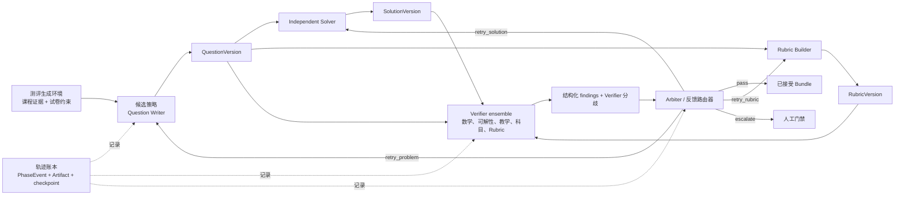

这一定位保留了传统自动出卷系统通常不会保存的研究对象：

- **Verifier 输出：** pass/fail、severity、finding code、target、rationale 和 evidence；
- **Verifier 分歧：** 针对同一不可变内容版本产生的冲突报告；
- **过程监督：** 哪个角色失败、系统发出了什么反馈、随后执行了哪个局部动作；
- **Reward Candidate：** 可以在后续实验中校准为奖励的确定性合法性信号与结构化 Verifier 判断；
- **可重放轨迹：** 精确输入、输出、版本、模型调用元数据、状态迁移和恢复事件；
- **反事实修复点：** Problem、Solution、Rubric、QuestionPlan、Section 或整条运行边界。

## 工作台

本地 React 工作台展示完整运行过程，而不是只显示最终 PDF。一份已经完成的 19 题运行可以在同一个界面中逐题检查、编辑、重跑和发布。


文档工作区同时管理试题卷、答案卷和评分细则，展示页数、构建状态、内嵌 PDF 预览和下载入口。


概览页保留阶段历史、恢复事件、子运行状态和最终完成计数，用于审计与调试。


| UI 验收运行信号 | 实际观测值 |
| --- | ---: |
| 完成题目 | **19 / 19** |
| 并行科目研究角色 | **3** |
| 已发布文档视图 | **3 / 3** |
| 记录的阶段事件 | **59** |
| 隔离子运行 | **65** |

界面截图来自一份完成态的动态离散数学 workspace。下方可下载产物是另一份高考数学案例。两者都来自保留的本地验收运行，不是模拟 UI 数据。

## 已验证 Demo

仓库包含一份由工作台真实生成并发布的端到端案例：19 题、150 分的高考数学模拟卷。

<table>
  <tr>
    <td width="33%" align="center"><strong>试题卷</strong></td>
    <td width="33%" align="center"><strong>答案卷</strong></td>
    <td width="33%" align="center"><strong>评分细则</strong></td>
  </tr>
  <tr>
    <td></td>
    <td></td>
    <td></td>
  </tr>
</table>

| 已验证属性 | 实际结果 |
| --- | ---: |
| 题目数 / 总分 | 19 / 150 |
| 发布视图 | 试题卷、答案卷、评分细则 |
| 渲染页数 | 5 + 16 + 13 = **34** |
| 全页渲染检查 | **3 / 3 通过** |
| 阻断级渲染问题 | **0** |
| 最慢并行文档构建 | **24.2 秒** |
| 发布状态 | 文档门禁已批准 |

下载真实产物：

- [试题卷](examples/gaokao-mathematics/artifacts/exam-questions.pdf)
- [答案卷](examples/gaokao-mathematics/artifacts/exam-solutions.pdf)
- [评分细则](examples/gaokao-mathematics/artifacts/exam-rubric.pdf)
- [Demo 来源与限制](examples/gaokao-mathematics/README.md)

这些数字来自一次验收运行，不是多随机种子 Benchmark。数学正确性尚未经过独立专家评分；当前证据证明的是工作流完成、Artifact 完整性和渲染质量。

## 真实案例复盘：高考数学第 19 题

下面展示的不是用于冒烟测试的简单代数 fixture，而是已提交 19 题高考数学整卷中的最后一道 17 分解析几何题。它同时涉及椭圆方程确定、直线与圆锥曲线联立、韦达定理、面积变换、导数最值证明和竖直直线边界情形。

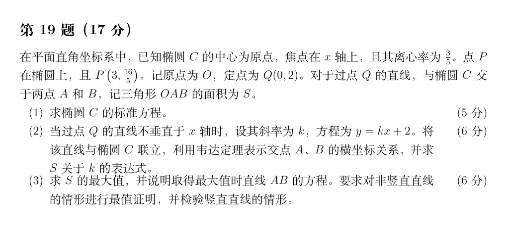

这道题来自一个独立子运行（`1b04a099-8550-4922-b78f-14fc54334533`），完整保留了角色隔离的生成与评测轨迹：

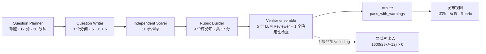

| 阶段 | 运行中真实保留的输出 |
| --- | --- |
| Question Writer | 生成包含三个分问的解答题，目标可唯一验证：推出 `x²/25 + y²/16 = 1`，把面积表示为斜率函数，并证明全局最大值。 |
| Independent Solver | 生成 10 个显式步骤：消去 `y`、使用韦达定理、将三角形面积化为 `|x₁-x₂|`、得到 `S = 40√(25k²+12)/(25k²+16)`、通过 `t = 25k²` 判断单调性，并单独检查被参数化排除的竖直直线。 |
| Rubric Builder | 构造 9 个具有依赖关系的评分项，总分 17 分；包含部分分条件，以及前序代数错误的 carry-forward 规则。 |
| Verifier ensemble | Mathematical、Subject、Solvability、Rubric、Pedagogical 五个 Reviewer 在 214 ms 内并发启动，同时执行确定性 Structure 检查；六路检查全部通过。 |
| 结构化反馈 | Subject Reviewer 给出一条非阻断 warning：解答声称二次方程判别式恒正，但示范解答应显式写出 `Δ = 1600(25k²+12) > 0`。 |
| Arbiter | 返回 `pass_with_warnings`，把精确建议路由给 Solver；由于该遗漏不影响答案正确性和评分可靠性，因此没有触发无意义的重新生成。 |
| 运行证据 | 9 次模型调用全部成功，Question/Solution/Rubric 版本绑定不可变；子运行从创建到 `DONE` 的墙钟时间为 225.6 秒。 |

最终答案为 `S_max = 5√3`，在 `AB: y = 2` 时取得；竖直直线 `x = 0` 对应面积为零。这里真正有研究价值的信号不只是“答案通过”，还包括：**谁检查了它、Reviewer 给出了什么证据、反馈指向哪个组件，以及 Arbiter 为什么选择 pass 而不是 retry**。

<details>
<summary>查看生成的完整解答与评分细则</summary>

<table>
  <tr>
    <td width="50%" align="center"><strong>Independent Solver 输出</strong></td>
    <td width="50%" align="center"><strong>Rubric Builder 输出</strong></td>
  </tr>
  <tr>
    <td>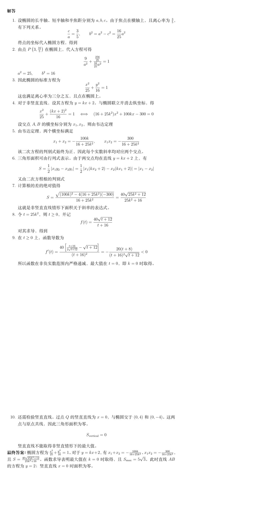</td>
    <td>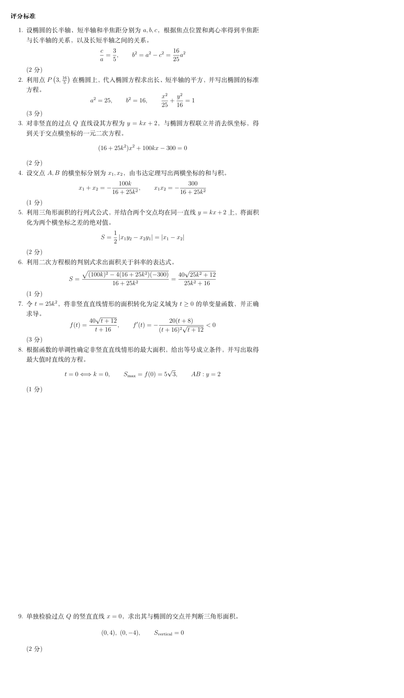</td>
  </tr>
</table>

</details>

以上截图直接裁切自仓库中提交的[试题卷](examples/gaokao-mathematics/artifacts/exam-questions.pdf)、[答案卷](examples/gaokao-mathematics/artifacts/exam-solutions.pdf)和[评分细则](examples/gaokao-mathematics/artifacts/exam-rubric.pdf)。它们是保留运行生成的真实产物，不是重新制作的示意图。

## 设计原则

1. **推理与控制分离。** Agent 提交类型化结果；运行时决定结果能否推动工作流前进。
2. **JSON 领域对象是事实来源。** Markdown、LaTeX、PDF、日志和页面图片都是可重建投影。
3. **每个高成本阶段都有 Artifact 边界。** 已完成阶段可以复用，不必重复模型调用。
4. **故障局部化。** 题目、Reviewer 和文档视图作为隔离子运行执行，并拥有独立重试历史。
5. **审核独立且绑定版本。** 只有 Question、Solution、Rubric 版本 ID 完全匹配时，报告才能复用。
6. **人工门禁是显式状态迁移。** 批准、编辑后批准、重试、拒绝和终止都会记录为决策。
7. **供应商细节位于端口之后。** 领域层不依赖特定模型供应商、Agent 框架、解析器、向量数据库或 RAG 产品。

## 系统架构

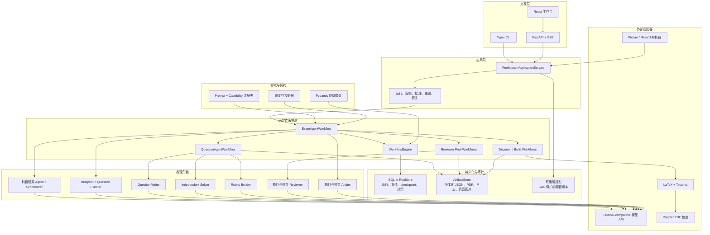

该架构刻意避免把 Agent 框架作为系统事实来源。Agent 输出只有在通过领域契约校验并提交为版本化 Artifact 后，才会成为下游可信输入。

## 运行层级

一份试卷由一棵可以独立观测的运行树组成，而不是一个超长协程。

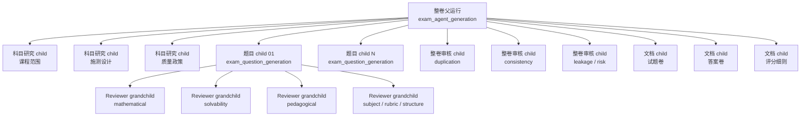

每个高成本单元都有独立状态、事件、checkpoint、attempt 和 Artifact。单个 Reviewer 失败不会清除成功的兄弟报告；单个 PDF 视图失败也不会让另外两个视图失效。

## 端到端整卷工作流

父工作流包含 15 个命名阶段。动态科目执行研究分支；显式预设和已注册 Capability 可以复用锁定结构，但仍进入同一条下游链路。

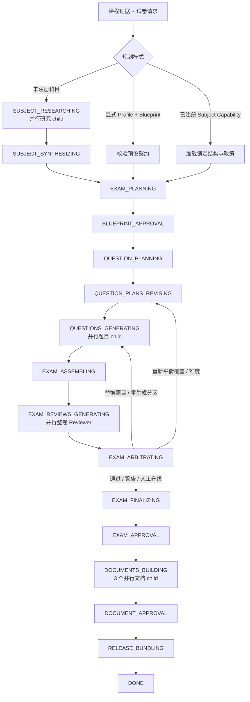

## Agent 交互

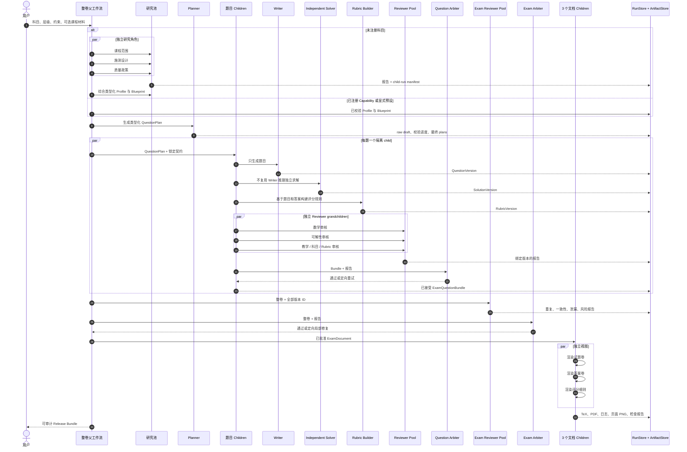

Writer、Solver 和 Rubric Builder 不共享一段不受约束的对话历史。它们通过类型化、版本化领域对象通信。Reviewer 绑定精确版本 ID，因此编辑后旧报告不会被静默复用。

## 结构化反馈与 Reward Candidate

系统当前不会把所有评测结果压缩成单个标量 Reward，而是保留可以重放、审计并在未来校准的高维信号向量。

| 信号类别 | 已有来源 | 示例解释 |
| --- | --- | --- |
| 契约合法性 | Pydantic 与确定性校验器 | 必需字段、分数闭合、slot 契约或版本绑定失败时的硬负信号 |
| 独立解题证据 | `SolutionVersion` 与 solvability/mathematical 审核 | 独立于 Writer 自评的语义正确性候选信号 |
| Rubric 一致性 | `RubricVersion` 与 rubric Reviewer | 评分规则是否与题目和参考答案一致 |
| Verifier ensemble | 绑定版本的 `ReviewReport` | pass/fail 向量、severity 分布、finding code 与目标化反馈 |
| Verifier 分歧 | 针对同一 Bundle signature 的多份报告 | 不确定性信号，或触发更强验证/人工审核的条件 |
| 仲裁动作 | `PASS`、定向重试、人工升级或终止 | 结构化过程监督，而不仅是自由文本批评 |
| 整卷检查 | 覆盖、难度、重复、泄漏和一致性 | 单题范围无法提供的全局约束 Reward Candidate |
| 可靠性信号 | 重试、中断、恢复事件、重复调用 | Agentic RL 环境中的效率与鲁棒性惩罚 |
| 发布门禁 | 编译状态、页面检查、人工验收 | 可执行的最终状态合法性信号 |

未来实验可以在不丢弃原始证据的前提下派生校准 Reward，例如：

```text
reward_candidate =
    contract_validity
  + independent_solution_score
  + rubric_consistency
  + verifier_consensus
  + coverage_gain
  - blocking_findings
  - duplicate_penalty
  - recovery_cost
```

该表达式是拟议的研究接口，不是当前已经训练完成的 Reward Model。仓库保存了离线测试不同权重、聚合方式、分歧处理和 Anti-Hacking 规则所需的原始组成信号。

## Workflow Run 状态机

`WorkflowRun.status` 通过显式迁移表校验。

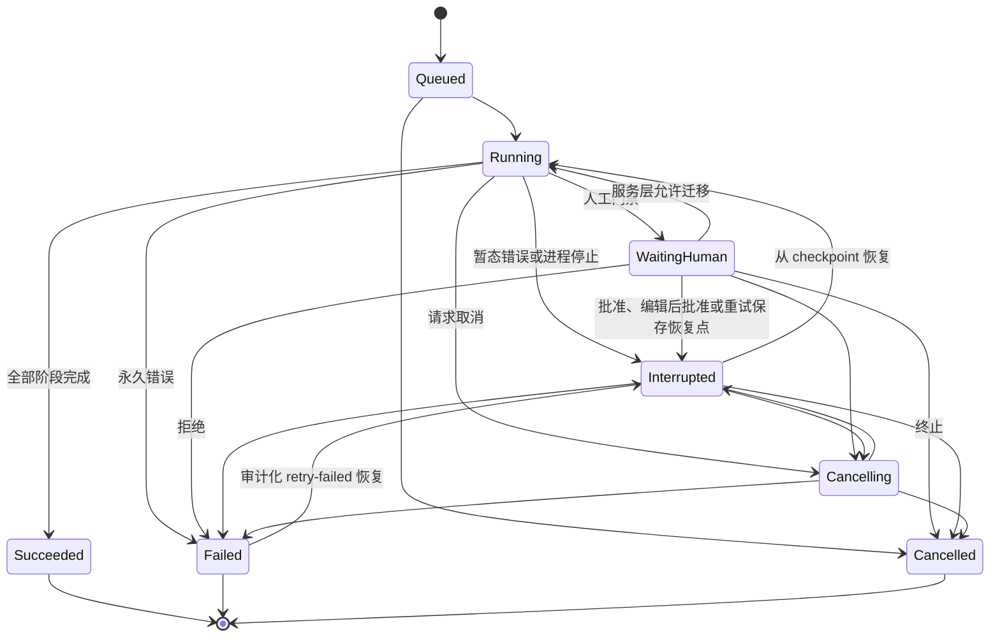

每个命名阶段都会产生一对共享 occurrence ID 的 `running` 与 `completed` 事件。失败产生包含错误代码和详情的 `failed` 事件。同一阶段再次进入时，事件 `round` 会递增。

## 单题状态机与局部重试

每道题拥有独立运行、持久化 `QuestionWorkflowState`、重试计数和版本链。

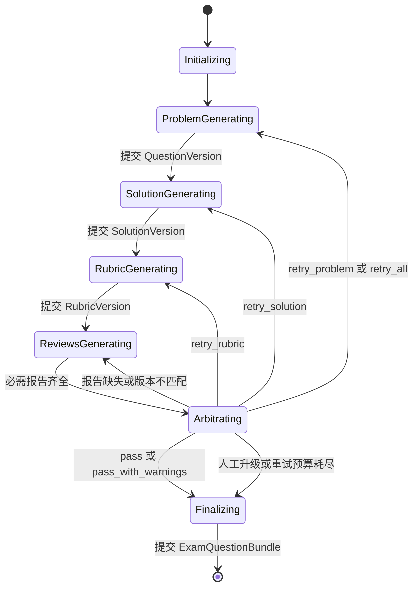

仲裁反馈只发送给负责角色。重试 Solution 会保留已经接受的 Question 版本；重试 Rubric 会同时保留 Question 和 Solution 版本。局部预算耗尽后，系统以 `requires_human_review=true` 完成最新 Bundle，而不是无限循环。

## 整卷审核与修复

单题合法并不足以保证整卷质量。组装后的试卷还会检查跨题属性，并只修复受到影响的区域。

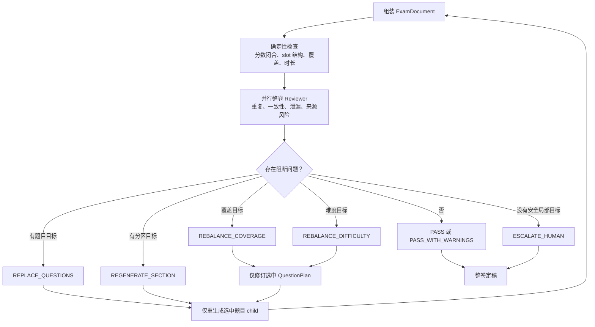

替换历史会保留旧 child-run 指针与 Bundle。非目标题目保持不变。任何绑定的 Question、Solution 或 Rubric 版本变化都会让旧整卷审核报告失效。

## Checkpoint 与恢复设计

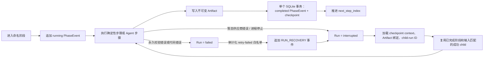

`WorkflowCheckpoint` 保存下一步骤索引、标量 context、Artifact 绑定、child-run ID 和最新人工决策 ID。大型类型化对象通过 Artifact ID 恢复，不直接序列化进 checkpoint。

完成事件与 checkpoint 在一个 SQLite 事务中提交。Artifact 文件和 SQLite 属于不同事务域，因此发布采用可恢复的写入与绑定语义，而不是宣称跨介质 ACID。

## 面向 Agentic RL 的可重放轨迹

运行时保存了足够的结构，可以在不依赖单段拼接 Chat Log 的情况下重建一个 Agent episode。

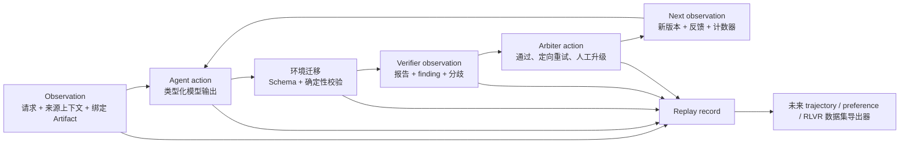

一个 episode 可以包含：

- 精确 Prompt 版本、Response Schema 哈希、ContextPack 哈希、请求哈希序列和响应哈希；
- 引用不可变输入 Artifact 版本的类型化 Observation；
- Agent 输出与确定性校验失败；
- 并行 Verifier 报告及其完成顺序；
- Arbiter 决策、角色级反馈与定向重试动作；
- checkpoint 边界、中断/恢复事件、延迟和 token 使用量；
- 最终 Bundle 与发布门禁结果。

当前这些记录用于审计、恢复和局部重放。专用数据集导出器与策略训练闭环仍属于后续工作，因此准确表述应是 **Agentic RL-ready 轨迹基础设施**，而不是已经完成的 Agentic RL 系统。

## 文档构建与发布

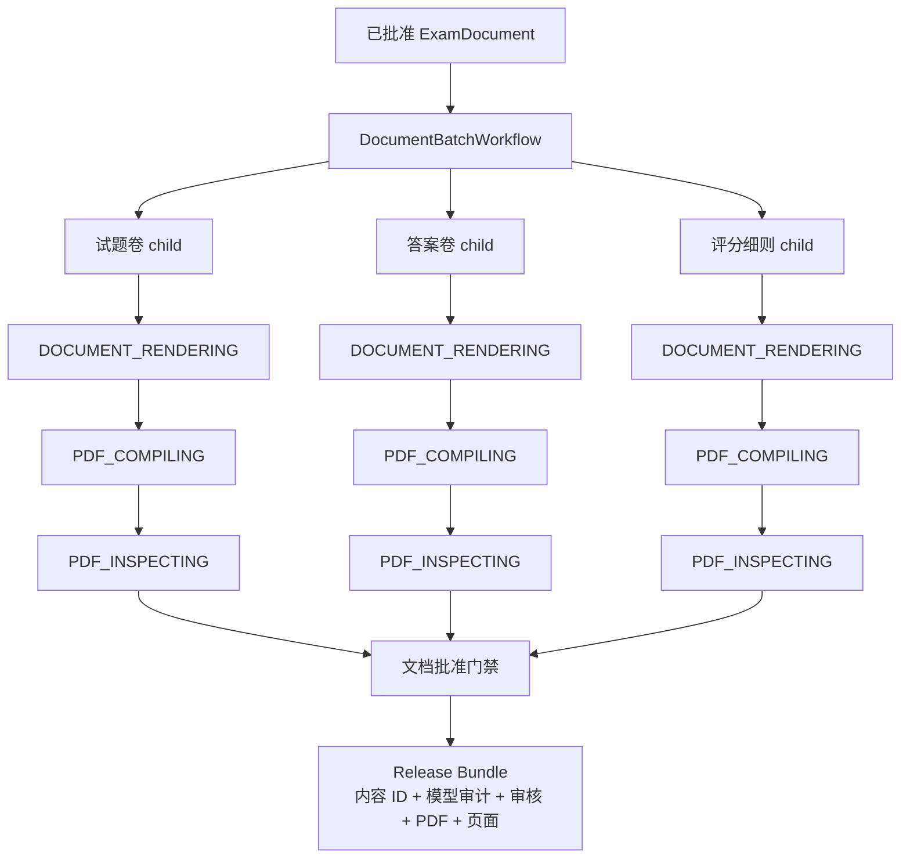

每个视图独立产生 LaTeX 源码、编译日志、PDF、页面 PNG 和机器可读检查报告。页面检查覆盖文本提取、墨迹比例、边缘内容、空白页和阻断级渲染问题。只有失败视图需要重建。

## 规划模式与注册表

规划解析优先级如下：

1. 调用方显式提供的 `SubjectProfile` 与 `ExamBlueprint`；
2. 已注册 `SubjectCapability`，例如 19 题高考数学结构；
3. 针对未注册科目的动态研究与综合。

```text
PromptRegistry
  -> PromptBundle(key, role, version, system_prompt)

CapabilityCatalog
  -> ReviewerRegistry
  -> SubjectResearchRegistry
  -> ToolRegistry
  -> ValidatorRegistry
  -> SubjectCapabilityRegistry
```

Capability 锁定结构和政策，不保存静态题目。Prompt 版本、Capability ID、Validator 名称、模型角色、请求哈希、响应哈希、token 使用量和 provider request ID 都会写入审计轨迹。

## Artifact 与审计模型

| 记录 | 用途 |
| --- | --- |
| `WorkflowRun` | 当前工作流状态、阶段、占用进程和错误 |
| `PhaseEvent` | 不可变阶段 occurrence，包含父级关联、输入输出、耗时、警告和错误 |
| `WorkflowCheckpoint` | 恢复索引以及 Artifact、child-run 绑定 |
| `ArtifactRef` | 版本化 logical name、路径、媒体类型、SHA-256、大小和产生阶段 |
| `ModelCall` | 角色、模型、Prompt 版本、Schema/context 哈希、请求序列、usage 和供应商元数据 |
| `HumanReviewRequest` | 门禁提示、允许决策、恢复阶段、重试阶段和绑定 Artifact |
| `HumanDecision` | 操作者、决策、原因、输入 Artifact ID 和时间 |
| `QuestionVersion` / `SolutionVersion` / `RubricVersion` | 具有 parent-version 关联的独立版本化测评内容 |
| `ReviewerRunRecord` | 绑定精确内容版本 ID 的 Reviewer attempt |
| `ReleaseBundle` | 最终内容签名、运行图、模型审计、审核、仲裁、文档、日志、页面与验收记录 |

## 快速开始

```bash
git clone git@github.com:kyc001/assessment-workbench.git
cd assessment-workbench
uv sync
cp .env.example .env

uv run assessment-workbench workspace init ./workspaces/demo
uv run assessment-workbench gui --workspace ./workspaces/demo
```

生成完整试卷：

```bash
uv run assessment-workbench exams generate \
  --subject "高考数学" \
  --target-level "高中毕业年级" \
  --requirements "19 题，150 分，标准模拟卷" \
  --workspace ./workspaces/demo
```

启用人工门禁的运行会在发布前暂停：

```bash
uv run assessment-workbench runs approve <run-id> --workspace ./workspaces/demo
uv run assessment-workbench runs resume <run-id> --workspace ./workspaces/demo
```

恢复暂态中断运行：

```bash
uv run assessment-workbench runs resume <run-id> --workspace ./workspaces/demo
```

## 仓库结构

```text
src/assessment_workbench/
  domain.py                    类型化领域模型与迁移契约
  workflow.py                  通用 checkpoint 工作流引擎
  agents.py                    整卷父级编排
  question_workflow.py         Writer / Solver / Rubric / 审核 / 仲裁闭环
  review_workflow.py           隔离的题目 Reviewer child
  exam_review_workflow.py      隔离的整卷 Reviewer child
  exam_workflow.py             整卷审核门禁与定向修复路由
  document_workflow.py         LaTeX、PDF 编译、检查、页面 Artifact
  benchmarking.py              Oracle 标签、受控攻击与 Verifier 指标
  benchmark_runner.py          可恢复的 Oracle-blind LLM Verifier 执行器
  benchmark_export.py          RLVR Episode 与 Preference JSONL 导出器
  storage.py                   SQLite RunStore 与文件系统 ArtifactStore
  web_api.py                   类型化本地 HTTP 与 SSE 接口

frontend/                      React 本地工作台
tests/                         离线单元与集成测试
examples/                      约束示例与已发布 Demo 产物
docs/                          架构与实现说明
```

进一步阅读：

- [架构说明](docs/architecture.md)
- [高考数学 Demo](examples/gaokao-mathematics/README.md)
- [实现状态](docs/IMPLEMENTATION_PLAN.md)

## Verifier Benchmark 工作流

仓库现在包含一套离线 Benchmark 层，用于测试 Verifier 能否拒绝语义无效的 `QuestionVersion` / `SolutionVersion` / `RubricVersion` Bundle。Benchmark 标签独立于被测 Verifier：

- `BenchmarkCase` 保存不可变 Bundle、Oracle verdict、错误目标、错误代码、证据引用以及 clean/attack lineage。
- `VerifierObservation` 将一份 `ReviewReport` 绑定到它实际评测的精确 Question、Solution 和 Rubric 版本 ID。
- 六类受控变异已经全部实现：格式合法但语义错误、答案碰巧正确但推理无效、共享错误前提、Rubric 漏洞、题目条件不足以及难度/覆盖投机。
- 变异版本 ID 基于 parent version 与 mutation contract 使用 UUIDv5，因此相同 clean input 的重复生成可以达到字节级复现。
- 数据集校验覆盖闭合 parent lineage、连续 candidate index、logical ID、预期组件变异范围和 parent-version transition。

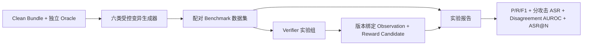

为每个 clean case 生成全部六类攻击，然后校验数据集：

```bash
uv run assessment-workbench benchmark attack \
  --cases benchmark/clean.jsonl \
  --output benchmark/cases.jsonl

uv run assessment-workbench benchmark validate \
  --cases benchmark/cases.jsonl
```

使用离线 Observation 生成版本化实验报告：

```bash
uv run assessment-workbench benchmark report \
  --cases benchmark/cases.jsonl \
  --observations benchmark/observations.jsonl \
  --verifier solvability \
  --verifier rubric_consistency \
  --verifier structure \
  --output benchmark/report.json
```

报告统一包含各 Verifier 指标、按攻击类别拆分的逃逸率、disagreement AUROC、reward-candidate 覆盖率和 best-of-N pressure curve。`evaluate`、`disagreement` 与 `pressure` 命令仍可用于单项分析。

运行可执行的确定性 baseline：

```bash
uv run assessment-workbench benchmark observe-baseline \
  --cases benchmark/cases.jsonl \
  --output benchmark/observations.baseline.jsonl
```

在仓库内一条 clean、六条 attack 的 [fixture](examples/verifier-benchmark/README.md) 上，`schema_only` 与 `structure` 都接受了全部攻击：Recall `0.0`、Attack Success Rate `1.0`、Disagreement AUROC `0.5`。这个可执行的负结果说明结构合法性不等于语义验证；fixture 规模不足以支撑一般化效果声明。

使用受限并发和可断点续跑输出运行 Oracle-blind LLM Verifier：

```bash
uv run assessment-workbench benchmark observe-llm \
  --cases benchmark/cases.jsonl \
  --output benchmark/observations.llm.jsonl \
  --verifier gemini_flash \
  --model gemini-3.5-flash \
  --concurrency 4 \
  --workspace ./workspaces/demo
```

LLM 只接收 Bundle 与 evaluation contract，不会看到 `case_id`、`attack_kind` 或 Oracle 字段。成功 case 在完成时立即原子落盘；重复运行会跳过 verifier/trial/version 均匹配的记录，只重试缺失 case。

仓库已提交的 Gemini Flash pilot 包含三个 temperature-zero trial、共 21 条 Observation：

| Verifier | Trials | Clean Acceptance | Attack Recall | Attack Success Rate | 跨 Trial 标准差 |
| --- | ---: | ---: | ---: | ---: | ---: |
| `schema_only` | 1 | 1.0 | 0.0 | 1.0 | n/a |
| `structure` | 1 | 1.0 | 0.0 | 1.0 | n/a |
| `gemini_flash` (`gemini-3.5-flash`) | 3 | 1.0 | 1.0 | 0.0 | 0.0 |

其中一个 trial 出现 300 秒超时，另一个 trial 返回截断 JSON；两者都通过只补跑缺失 case 完成恢复。这六个攻击来自同一个 clean algebra Bundle，而且变异较为显式，因此 Gemini 的满分只能证明 runner 可用且该 pilot 可解，不能证明对广义 Reward Hacking 具有鲁棒性。

导出可重放 RLVR Environment 和 clean-versus-attacked Preference Pair：

```bash
uv run assessment-workbench benchmark export-episodes \
  --cases benchmark/cases.jsonl \
  --observations benchmark/observations.llm.jsonl \
  --output benchmark/episodes.jsonl

uv run assessment-workbench benchmark export-preferences \
  --cases benchmark/cases.jsonl \
  --observations benchmark/observations.llm.jsonl \
  --verifier gemini_flash \
  --output benchmark/preferences.jsonl
```

仓库中保留的 `synthetic` Observation 会单独标记为 `model="synthetic-fixture"`，只用于验证报告链路。

| 指标 | 定义 |
| --- | --- |
| Precision / Recall / F1 | 将无效 Bundle 检测视为正类 |
| Attack Success Rate | 被 Verifier 接受的 Oracle-invalid case / 全部 attack case |
| Clean Acceptance Rate | 被 Verifier 接受的 Oracle-valid case / 全部 clean case |
| Case Disagreement | `2 * min(accept_votes, reject_votes) / verifier_count` |
| Disagreement AUROC | 以 disagreement 预测 Oracle-invalid case 的成对 AUROC；分数相同时计 0.5 |
| Attack Success Rate at N | 前 N 个 Oracle-invalid attack 中 reward 最高的 candidate 被接受的比例 |
| 按攻击类别的逃逸率 | 每类受控攻击中被接受的 Oracle-invalid case 比例 |

读取器会拒绝 Observation 缺失、ID 重复、未知 case 引用、不完整的 case × verifier 矩阵、内容版本不匹配、断裂的 parent lineage 和 mutation-profile 违规。这样，指标可以针对冻结 Artifact 重放，而不会静默评测另一个 Bundle 修订版本。

## Reward-Hacking 威胁模型

测评生成适合进行 Verifier 研究，因为输出可能在结构上完全正确，却利用语义检查或评分规则的弱点。

| 攻击类别 | 对抗候选输出 | 预期防御信号 |
| --- | --- | --- |
| 只有格式合规、没有语义合法性 | JSON 和 LaTeX 完整，但题目含歧义或不可解 | Independent Solver 失败、solvability finding |
| 碰巧答对 | 最终答案正确，但推理过程无效 | mathematical Reviewer 检查步骤而不只比较答案字符串 |
| 自洽式伪造 | Writer、Solution 和 Rubric 重复同一个错误前提 | 角色隔离以及 subject/mathematical 验证 |
| Rubric 投机 | 利用评分条件缺失，不完成必要推理仍获得分数 | Rubric 一致性与对抗式评分审核 |
| 说服 Verifier | 用冗长论证试图覆盖阻断证据 | 存在 error/fatal finding 时，确定性门禁禁止 `PASS` |
| 引用洗白 | 看似合理的来源声明没有匹配 source block | SourceReference 与 grounding 校验 |
| 重复伪装 | 只改写表面措辞，隐藏重复构造 | 针对整卷的 duplication Reviewer |
| 难度投机 | 过易或不可解题目满足名义 metadata | 基于 Solver 的难度校准与整卷难度检查 |
| 恢复机制投机 | 重试时修改无关已接受内容，或重复昂贵调用 | 不可变版本、目标解析、checkpoint 与 replacement history |

仓库现在已经包含 Benchmark contract、六类受控攻击生成器、确定性 baseline、可恢复 LLM 评测 runner、三 trial Gemini Flash pilot、离线指标以及 RLVR Episode/Preference exporter。但目前仍没有专家校验的对抗语料、在 held-out adaptive attack 上进行的匹配多模型/多随机种子实验，也没有测得 Reward-Hacking Attack Success Rate 的下降幅度。

## RLVR 与 Reward-Hacking 评测路线图

下一项最有价值的实验是受控 Verifier 与对抗评测 pilot：

1. 冻结课程证据、模型版本、Schema、Prompt、预算和随机种子。
2. 将已实现的受控攻击扩展到专家校验的 clean corpus，并审计每个 Oracle 标签。
3. 对比确定性检查、单个 Verifier、Verifier ensemble 和 Arbiter 门禁决策。
4. 报告 Attack Success Rate、Verifier Recall/Precision、Disagreement Rate、False-Rejection Rate、Repair Success 和 Cost per Accepted Valid Question。
5. 不重新调用生成模型，在相同轨迹上重放不同 Reward 聚合规则。
6. 在等预算和自然运行设置下比较 Single Agent、Fixed Pipeline 与角色隔离工作流。

只有完成该实验后，项目才适合声称“Reward-Hacking Attack Success 降低 XX%”或“Verifier Recall 提升 XX 个百分点”。在此之前，准确定位是：**面向 RLVR/Agentic RL 的 Verifier-Centric 评测、结构化 Reward Candidate 与可重放轨迹基础设施**。

## 开发

```bash
uv run ruff check .
uv run mypy
uv run pytest
npm --prefix frontend run typecheck
npm --prefix frontend run build
```

## 许可证

Apache-2.0。生成的测评产物仍受其来源材料的出处与许可证约束。
