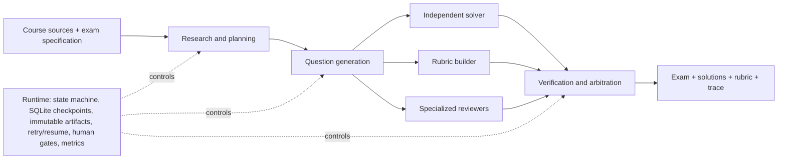

# Assessment Workbench

> Auditable, role-separated workflows for generating complete exams from course materials and assessment constraints.

[](https://www.python.org/)
[](https://fastapi.tiangolo.com/)
[](frontend/)
[](LICENSE)

Assessment Workbench studies a practical question: **can an LLM-based exam generator be made inspectable, recoverable, and safer than a single opaque prompt?**

Given course evidence and an exam specification, the system produces a student paper, independently derived solutions, scoring rubrics, reviewer decisions, execution traces, and release-ready PDFs. Reasoning roles are separated, while deterministic code owns schemas, state transitions, persistence, validation, and document gates.

## Workbench

The local React workbench exposes the complete run instead of hiding it behind a final PDF. A completed 19-question acceptance run can be inspected question by question, edited, rerun, and published from the same interface.


The document view keeps the student paper, worked solutions, and scoring rubric together, with page counts, build status, inline PDF preview, and direct downloads.


The overview retains the phase timeline, recovery events, child-run states, and final completion counters for audit and debugging.


| UI acceptance-run signal | Observed value |
| --- | ---: |
| Completed questions | **19 / 19** |
| Parallel subject-research roles | **3** |
| Published document views | **3 / 3** |
| Recorded phase events | **59** |
| Isolated child runs | **65** |

The interface screenshots use a completed dynamic discrete-mathematics workspace. The downloadable release below is a separate Gaokao mathematics case study; both are preserved local acceptance runs rather than mocked UI data.

## Verified Demo

The repository includes a real end-to-end release produced by the workbench: a 19-question, 150-point Chinese Gaokao mathematics mock exam.

<table>
  <tr>
    <td width="33%" align="center"><strong>Student paper</strong></td>
    <td width="33%" align="center"><strong>Worked solutions</strong></td>
    <td width="33%" align="center"><strong>Scoring rubric</strong></td>
  </tr>
  <tr>
    <td></td>
    <td></td>
    <td></td>
  </tr>
</table>

| Verified property | Observed result |
| --- | ---: |
| Questions / total score | 19 / 150 |
| Published views | student paper, solutions, rubric |
| Rendered pages | 5 + 16 + 13 = **34** |
| Full-page render inspections | **3 / 3 passed** |
| Blocking render findings | **0** |
| Slowest of the three parallel document builds | **24.2 s** |
| Release status | document gate approved |

Download the actual artifacts:

- [Student paper](examples/gaokao-mathematics/artifacts/exam-questions.pdf)
- [Worked solutions](examples/gaokao-mathematics/artifacts/exam-solutions.pdf)
- [Scoring rubric](examples/gaokao-mathematics/artifacts/exam-rubric.pdf)
- [Demo provenance and limitations](examples/gaokao-mathematics/README.md)

These are acceptance-run measurements, not a multi-seed benchmark. Mathematical correctness has not yet been independently expert-rated; the current evidence establishes workflow completion, artifact integrity, and render quality.

## Method



The central design choice is **role separation with artifact boundaries**:

- the Writer cannot silently redefine the Solver's result;
- solutions and rubrics are versioned independently from question text;
- mathematical, solvability, pedagogy, subject, and rubric reviewers run as isolated checks;
- the Arbiter routes only the failed question or stage back for revision;
- every completed stage commits an immutable Artifact reference and SQLite checkpoint;
- interrupted runs resume from the last committed boundary instead of replaying successful upstream calls;
- three PDF views compile and render independently, so one failed view does not invalidate the other two.

## Product Surface

The same application service powers both the CLI and a local React workbench. The GUI creates exams, streams workflow progress, exposes per-question versions, supports targeted reruns and edits, browses artifacts, and previews all three PDF views.

```bash
uv sync
uv run assessment-workbench gui --workspace ./workspaces/demo
```

The service binds to `127.0.0.1` by default and is intentionally a local single-user research tool, not a multi-tenant administration system.

## Reproduce a Run

```bash
git clone git@github.com:kyc001/assessment-workbench.git
cd assessment-workbench
uv sync
cp .env.example .env

uv run assessment-workbench workspace init ./workspaces/demo
uv run assessment-workbench exams generate \
  --subject "高考数学" \
  --target-level "高中毕业年级" \
  --requirements "19 题，150 分，标准模拟卷" \
  --workspace ./workspaces/demo
```

The registered Gaokao capability locks the exam structure and deterministic policies. Unregistered subjects instead trigger parallel subject research, synthesis, and blueprint generation before question writing begins.

Runs with human gates pause before release:

```bash
uv run assessment-workbench runs approve <run-id> --workspace ./workspaces/demo
uv run assessment-workbench runs resume <run-id> --workspace ./workspaces/demo
```

Transient model failures preserve checkpoints and mark the run `interrupted`. Resume the same run without discarding completed artifacts:

```bash
uv run assessment-workbench runs resume <run-id> --workspace ./workspaces/demo
```

## System Boundaries

| Layer | Responsibility |
| --- | --- |
| Domain models | Typed exams, questions, solutions, rubrics, reviews, decisions, manifests |
| Agent workflows | Research, planning, writing, independent solving, reviewing, arbitration |
| Deterministic runtime | State machine, validation, retries, checkpoint/resume, concurrency |
| Storage | SQLite run/event ledger plus content-addressed Artifact files |
| Document pipeline | LaTeX generation, Tectonic compilation, Poppler inspection, page artifacts |
| Interfaces | Typer CLI, FastAPI/SSE service, React workbench |

The domain layer does not depend on a specific model provider, Agent framework, vector database, or document parser. OpenAI-compatible models and MinerU are adapters behind explicit ports.

## Repository Map

```text
src/assessment_workbench/   domain, workflows, storage, CLI and Web API
frontend/                   React local workbench
tests/                      offline unit and integration coverage
examples/                   reproducible constraints and published demo artifacts
docs/                       architecture, roadmap and implementation notes
```

Start with:

- [Architecture](docs/architecture.md)
- [Gaokao demo](examples/gaokao-mathematics/README.md)
- [Implementation status](docs/IMPLEMENTATION_PLAN.md)

## Evaluation Roadmap

The next research milestone is a controlled pilot comparing:

1. a single Agent that plans, writes, solves, grades, and self-checks in one context;
2. a fixed staged pipeline without isolated child runs or local arbitration;
3. the role-separated Assessment Workbench workflow.

The comparison should report equal-budget and natural-run settings, valid-question rate, reference-answer accuracy, answer-rubric consistency, cost per accepted question, latency, and recovery overhead. Until that experiment is run, this repository does **not** claim a quality improvement over those baselines.

## Development

```bash
uv run ruff check .
uv run mypy
uv run pytest
npm --prefix frontend run typecheck
npm --prefix frontend run build
```

## License

Apache-2.0. Generated assessment artifacts remain subject to the provenance and licensing of their source materials.
