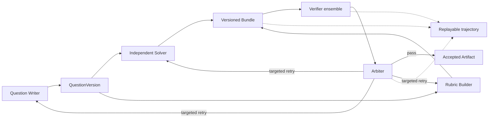
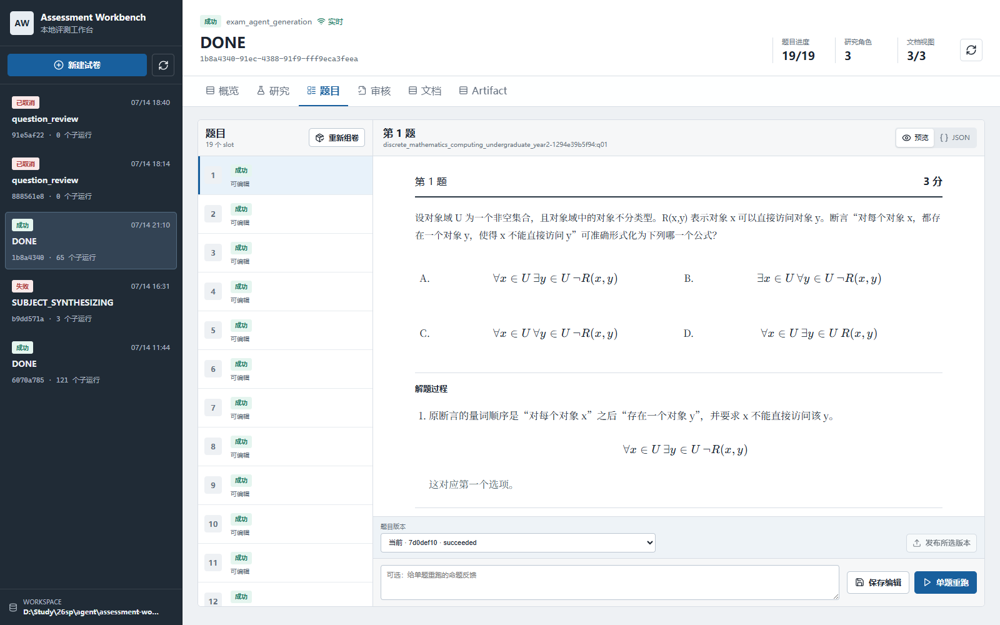
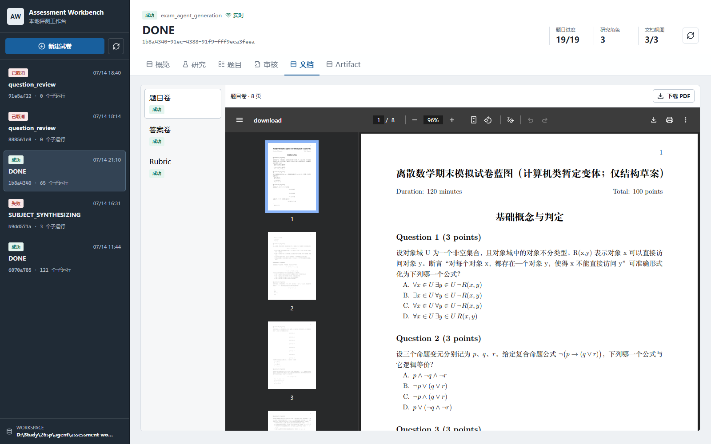
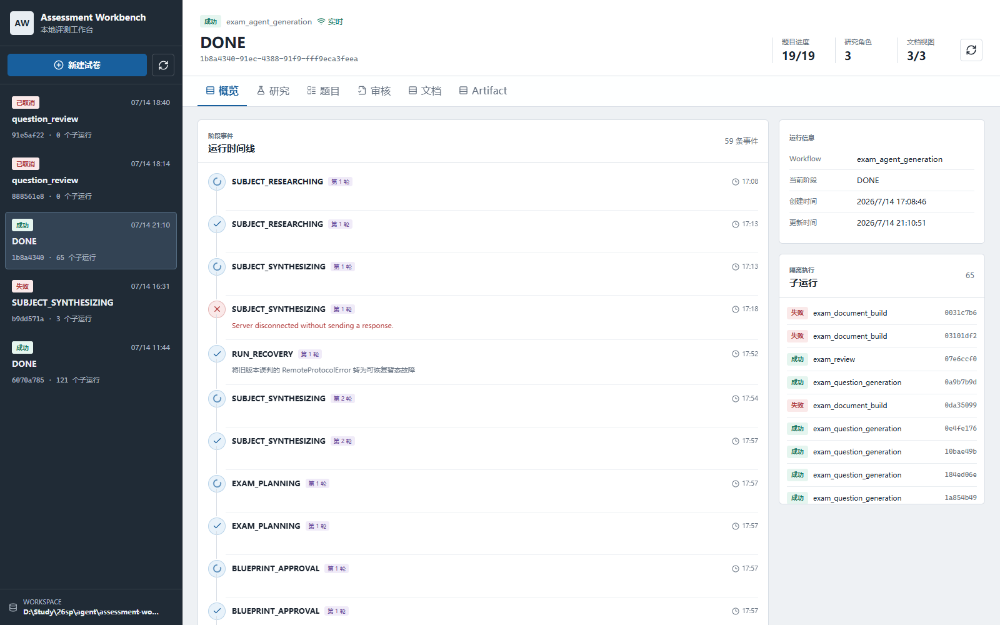
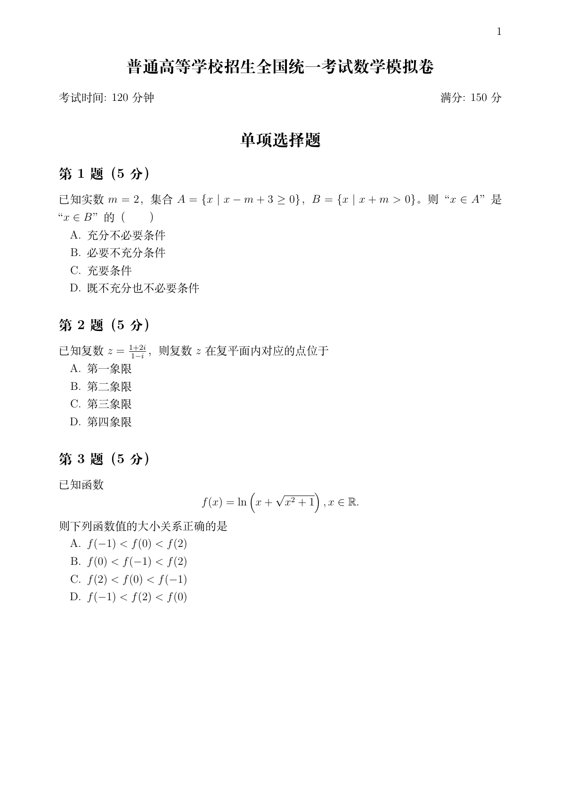
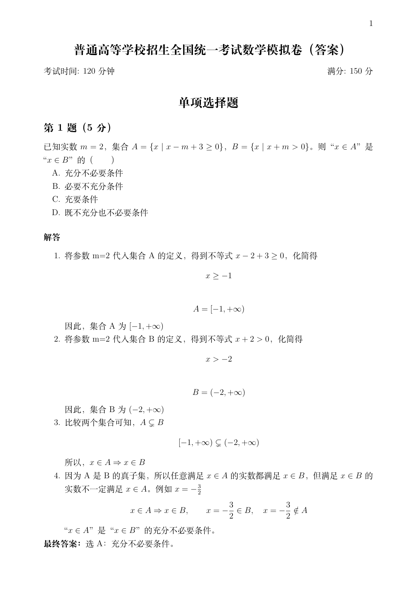
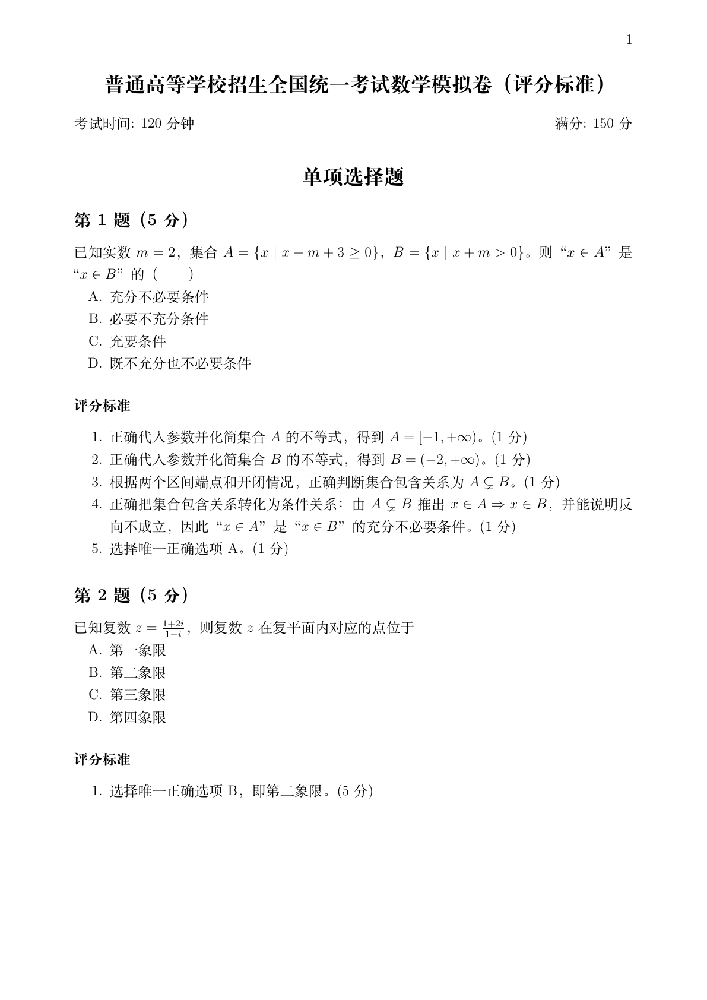

# Assessment Workbench

> 面向 RLVR / Agentic RL 的 Verifier-Centric 多智能体评测、结构化反馈与可重放轨迹基础设施。

[English](README.en.md) · [技术报告](REPORT.md) · [架构文档](docs/architecture.md)

[](https://www.python.org/)
[](https://fastapi.tiangolo.com/)
[](frontend/)
[](LICENSE)

Assessment Workbench 把“生成一份试卷”实现为可验证的多智能体环境：Writer 生成候选题目，Independent Solver 独立求解，Rubric Builder 构造评分契约，多个专业 Reviewer 组成 Verifier ensemble，Arbiter 把结构化 finding 路由为通过、局部重试或人工升级。

项目不会把一次 Prompt 输出当作最终事实。题目、解答、Rubric、审核报告、状态迁移、失败、重试和 checkpoint 都被版本化保存，可用于离线评测、轨迹重放和后续 Reward / RLVR 实验。

## 项目概览

| 已完成能力 | 仓库中的真实证据 |
| --- | --- |
| 公开过程评测 | ProcessBench GSM8K 全量 400 条 case、Oracle-blind Observation 与离线报告 |
| 多智能体生成 | Writer、Solver、Rubric Builder、5 类 LLM Reviewer、确定性检查与 Arbiter |
| 可恢复运行 | 增量 Observation、checkpoint、局部 retry、child run 隔离 |
| 可视化工作台 | React 界面展示题目、阶段、事件、文档和发布状态 |
| 可发布 Artifact | 19 题 / 150 分试卷，试题、答案、Rubric 共 34 页 PDF |
| RLVR 数据出口 | 版本化 Observation、Reward Candidate、episode / preference JSONL |



架构、状态机、Agent 交互和 Reward Candidate 定义统一放在 [REPORT.md](REPORT.md)，README 只保留项目展示与真实 Case。

## ProcessBench：真实过程验证结果

[ProcessBench](https://huggingface.co/datasets/Qwen/ProcessBench) 要求 Verifier 判断一条数学解答是否正确；若不正确，还要定位**第一处错误步骤**。这比只检查最终答案更适合观察过程奖励是否会被“答案碰巧正确”的轨迹欺骗。

实验设置：公开 GSM8K split，全量 400 条；`gemini-3.5-flash`；temperature 0；单 trial；Prompt 不包含 Oracle 的 `first_error_step` 或 `final_answer_correct`。

| 指标 | Gemini Flash |
| --- | ---: |
| Case 数 | **400** |
| 第一处错误精确匹配 | **364 / 400 = 91.0%** |
| 错误过程检出率 | **203 / 207 = 98.1%** |
| 错误过程首错精确定位率 | **174 / 207 = 84.1%** |
| 正确过程接受率 | **190 / 193 = 98.4%** |
| 最终答案正确但过程错误的 trap 定位率 | **3 / 7 = 42.9%** |

原始数据与报告：

- [400 条公开 Case](examples/processbench-gsm8k/cases.full.jsonl)
- [Gemini Flash 原始 Observation](examples/processbench-gsm8k/observations.gemini-flash.full.jsonl)
- [完整离线报告](examples/processbench-gsm8k/report.gemini-flash.full.json)
- [实验说明与复现命令](examples/processbench-gsm8k/README.md)

总体分数看起来较高，但失败结构值得单独看：模型只漏检了 4 条错误过程，却有 29 条过程被判错了首错位置；此外 7 条 lucky-answer trap 中只有 3 条被精确定位。也就是说，**判断“有错”明显容易于判断“从哪一步开始错”**，而正确最终答案仍会掩盖局部语义错误。

下面展示同一 Verifier 的一条成功和一条失败。两条都来自公开 Benchmark，不是为了截图手写的示例。

## Case 1：成功定位普通推理错误

**ProcessBench ID：** `gsm8k-0`；**候选解答生成模型：** `Qwen2-7B-Instruct`

**题目**

Sue 的草坪上周五有 18 只粉色塑料火烈鸟。周六，邻居取走其中三分之一，涂成白色后放回；周日又加入 18 只粉色火烈鸟。周日中午，粉色比白色多多少只？

**候选模型解答**

1. 周五有 18 只粉色火烈鸟。
2. 周六取走 `18 × 1/3 = 6` 只并涂成白色，因此应剩 12 只粉色、增加 6 只白色；但候选解答随后写成：

   > “Thus, by the end of Saturday, Sue has `12 + 6 = 18` pink flamingos and 6 white flamingos.”

3. 它继续用错误状态计算周日有 `18 + 18 = 36` 只粉色。
4. 最终得到 `36 - 6 = 30`。

**错误在哪里**

`12 + 6 = 18` 是粉色和白色的**总数**，不是粉色数量。周六结束时应为 12 只粉色、6 只白色；周日应为 30 只粉色、6 只白色，正确差值是 24。

**Oracle 与 Gemini 判断**

| | 第一处错误步骤 | confidence | 结论 |
| --- | ---: | ---: | --- |
| ProcessBench Oracle | 1 | - | 候选过程错误 |
| Gemini Flash | 1 | 1.0 | **定位正确** |

Gemini 的原始理由指出，候选解答“把总数 18 错当成粉色数量”，因此准确命中了第一处错误，而不是只看到最终答案 30 不匹配。

## Case 2：正确最终答案掩盖了过程错误

**ProcessBench ID：** `gsm8k-290`；**候选解答生成模型：** `Qwen2-1.5B-Instruct`

**题目**

Zack 的柜子是 Timothy 的一半；Peter 的柜子是 Zack 的四分之一。Peter 的柜子为 5 立方英寸，Timothy 的柜子有多大？

**候选模型解答**

1. 候选解答计算 `5 ÷ (1/4) = 20`，得到 Zack 的柜子为 20；但同一句自然语言写成：

   > “Zack's locker (which is **twice as big**) would be ... `5 × 4 = 20`.”

2. 随后计算 `20 × 2 = 40`，最终答案 40 正确。

**错误在哪里**

Peter 是 Zack 的四分之一，所以 Zack 应是 Peter 的**四倍**，不是“两倍”。算式乘了 4，文字却说乘 2；这是步骤内部的语义矛盾。ProcessBench 因此把步骤 0 标为第一处错误，即使最终答案碰巧正确。

**Oracle 与 Gemini 判断**

| | 第一处错误步骤 | confidence | 结论 |
| --- | ---: | ---: | --- |
| ProcessBench Oracle | 0 | - | 候选过程错误 |
| Gemini Flash | -1 | 1.0 | **漏检，判为全过程正确** |

Gemini 的原始理由是：

> “Both steps are mathematically and logically correct ... The steps are entirely accurate.”

它复述了正确算式和最终答案，却没有核对同一步骤中自然语言“twice”与 `×4` 是否一致。这个 Case 具体展示了 process verifier 的 Reward-Hacking 风险：候选轨迹可以凭正确结论获得高置信通过，同时保留无效推理陈述。

## Web 工作台

本地 React 工作台展示完成态运行，而不是只显示最终 PDF。题目工作区支持逐题检查、编辑、重跑和发布。



文档工作区同时管理试题、答案和评分细则，显示构建状态、页数、PDF 预览和下载入口。



概览页保留阶段历史、恢复事件、child run 和最终计数。



| 截图对应的真实运行信号 | 观测值 |
| --- | ---: |
| 完成题目 | **19 / 19** |
| 并行科目研究角色 | **3** |
| 已发布文档视图 | **3 / 3** |
| 阶段事件 | **59** |
| 隔离 child run | **65** |

## 已发布试卷 Artifact

仓库保留了一份真实生成并发布的 19 题、150 分高考数学模拟卷。

<table>
  <tr>
    <td width="33%" align="center"><strong>试题卷</strong></td>
    <td width="33%" align="center"><strong>答案卷</strong></td>
    <td width="33%" align="center"><strong>评分细则</strong></td>
  </tr>
  <tr>
    <td></td>
    <td></td>
    <td></td>
  </tr>
</table>

| Artifact 验收项 | 结果 |
| --- | ---: |
| 题目数 / 总分 | 19 / 150 |
| PDF 页数 | 5 + 16 + 13 = **34** |
| 全页渲染检查 | **3 / 3 通过** |
| 阻断级渲染问题 | **0** |
| 最慢并行文档构建 | **24.2 秒** |

[下载试题卷](examples/gaokao-mathematics/artifacts/exam-questions.pdf) · [下载答案卷](examples/gaokao-mathematics/artifacts/exam-solutions.pdf) · [下载评分细则](examples/gaokao-mathematics/artifacts/exam-rubric.pdf)

这些产物证明工作流完成、版本绑定、Artifact 完整性和渲染质量；整卷数学质量尚未经过独立专家评分。

## 快速开始

```bash
git clone git@github.com:kyc001/assessment-workbench.git
cd assessment-workbench
uv sync
cp .env.example .env

uv run assessment-workbench workspace init ./workspaces/demo
uv run assessment-workbench gui --workspace ./workspaces/demo
```

生成一份完整试卷：

```bash
uv run assessment-workbench exams generate \
  --subject "高考数学" \
  --target-level "高中毕业年级" \
  --requirements "19 题，150 分，标准模拟卷" \
  --workspace ./workspaces/demo
```

运行可恢复的 ProcessBench Verifier：

```bash
uv run assessment-workbench benchmark observe-process \
  --cases examples/processbench-gsm8k/cases.full.jsonl \
  --output examples/processbench-gsm8k/observations.gemini-flash.full.jsonl \
  --verifier gemini_flash \
  --model gemini-3.5-flash \
  --trial 1 \
  --concurrency 1 \
  --request-delay 10 \
  --workspace workspaces/processbench-gemini

uv run assessment-workbench benchmark report-process \
  --cases examples/processbench-gsm8k/cases.full.jsonl \
  --observations examples/processbench-gsm8k/observations.gemini-flash.full.jsonl \
  --verifier gemini_flash \
  --trial 1 \
  --output examples/processbench-gsm8k/report.gemini-flash.full.json
```

## 仓库结构

```text
src/assessment_workbench/   领域模型、工作流、Agent、Verifier 与存储
frontend/                   React 本地工作台
tests/                      离线单元与集成测试
examples/processbench-gsm8k/公开 Benchmark case、Observation 与报告
examples/gaokao-mathematics/完整试卷 Artifact
docs/                       架构与实现文档
```

技术细节见 [REPORT.md](REPORT.md)，实现级架构见 [docs/architecture.md](docs/architecture.md)。

## 证据边界

当前项目可以声称：已经实现 Verifier-Centric 多智能体评测、结构化反馈、可恢复执行、公开过程 Benchmark 和可重放轨迹基础设施。

当前项目不能声称：已经完成 RL 训练、提升 Reward Model、通过因果实验降低 Reward Hacking，或证明多智能体方案优于同预算单智能体。相关结论需要多模型、多 trial、专家校验攻击集和 matched-budget 对照实验。

## License

[Apache-2.0](LICENSE)
