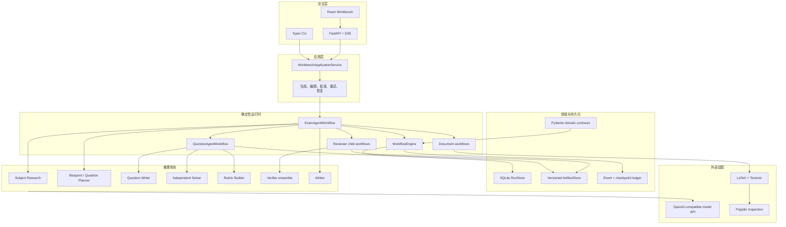
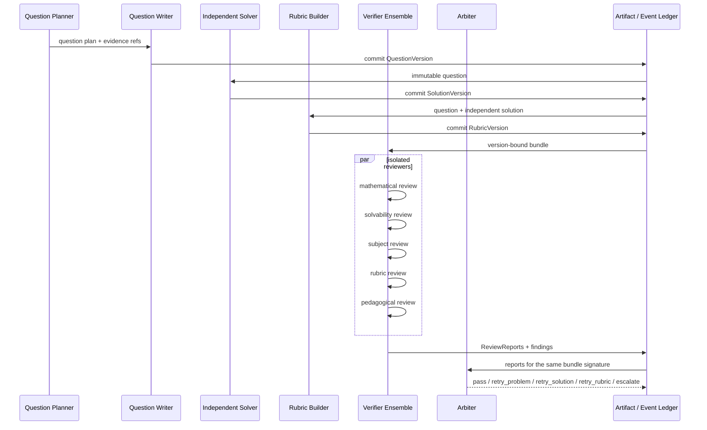
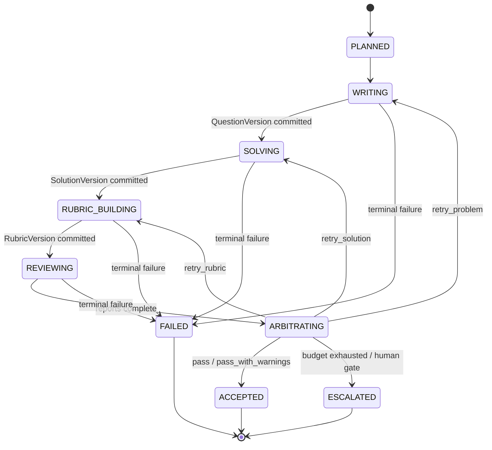
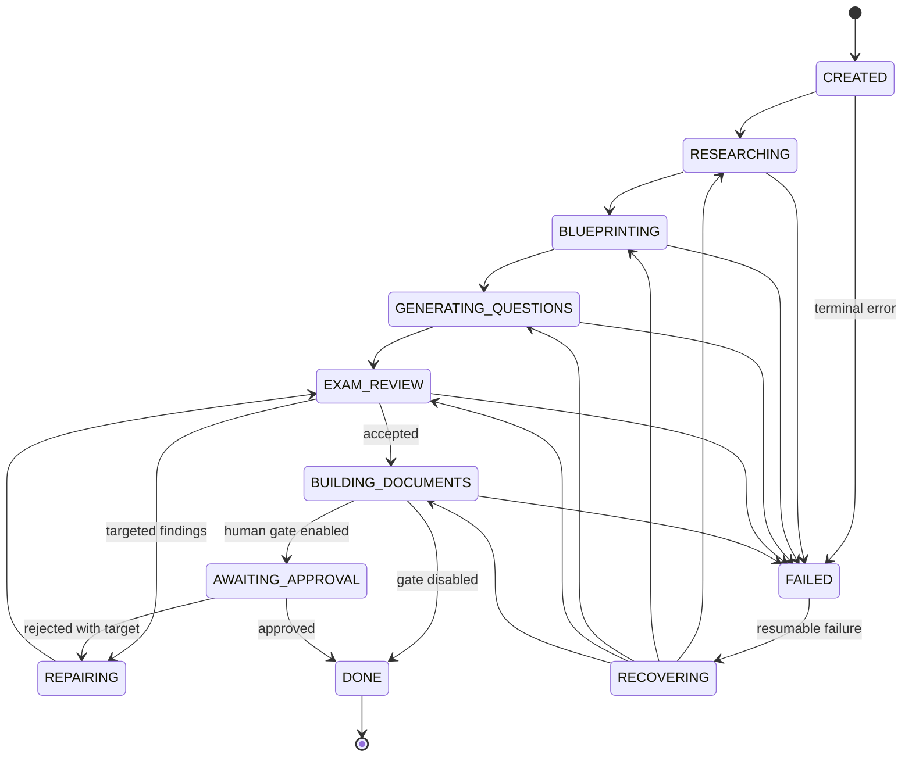
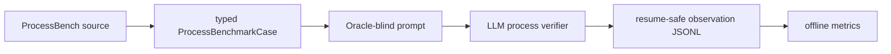

# Assessment Workbench 技术报告

> 本文集中说明系统架构、状态机、Agent 交互、Verifier 信号、可恢复执行与实验边界。项目展示、运行截图和具体 Case 请先看 [README](README.md)。

## 1. 研究问题与证据边界

Assessment Workbench 研究的问题不是“让一个 LLM 自动出卷”，而是：

> 如何把多智能体生成过程变成可验证、可审计、可局部修复、可离线重放的评测环境？

测评生成提供了一个适合研究 Verifier 的具体环境：候选题目不仅要格式正确，还要可解、答案一致、评分规则完整，并满足课程覆盖和难度约束。系统因此保存三类可用于后续 RLVR / Agentic RL 实验的对象：

- 版本化候选：`QuestionVersion`、`SolutionVersion`、`RubricVersion`；
- 结构化反馈：Verifier verdict、severity、finding code、target、evidence、rationale；
- 可重放轨迹：模型调用、Artifact、状态迁移、retry、checkpoint、人工决策。

当前仓库已经完成评测、反馈和轨迹基础设施，但没有训练策略或 Reward Model，也不声称已经降低 Reward Hacking。

## 2. 总体架构



核心边界是“推理与控制分离”：Agent 只能提交类型化候选，运行时负责校验、版本绑定、状态迁移、重试预算和持久化。模型输出不会直接成为系统事实。

## 3. Agent 角色与契约

| 角色 | 输入 | 输出 | 隔离目的 |
| --- | --- | --- | --- |
| Subject Research | 课程材料与目标 | 证据摘要、能力覆盖 | 将课程依据与出题 Prompt 分离 |
| Blueprint Planner | 研究摘要与整卷约束 | section、分值、难度、覆盖计划 | 在生成前冻结整卷级约束 |
| Question Planner | blueprint slot | 单题目标与能力要求 | 为每道题提供可审计任务单 |
| Question Writer | 单题计划、课程证据 | `QuestionVersion` | 只负责候选题面，不接触 Solver 私有推导 |
| Independent Solver | 题面 | `SolutionVersion` 与逐步推理 | 独立检查可解性和答案一致性 |
| Rubric Builder | 题面与独立解答 | `RubricVersion` | 把评分规则变成显式契约 |
| Reviewer ensemble | 同一版本 Bundle | 多份 `ReviewReport` | 从数学、可解性、教学、科目、Rubric 等角度独立验证 |
| Arbiter | 版本绑定的 ReviewReport 集合 | pass、定向 retry、escalate | 将分歧转换成确定性控制动作 |

所有 ReviewReport 都绑定精确的 Question、Solution、Rubric version ID。任一组件变化后，旧报告不能被静默复用。

## 4. Agent 交互



反馈路由是局部的。题面问题回到 Writer，推导问题回到 Solver，评分问题回到 Rubric Builder；已经接受且未受影响的 Artifact 不重新生成。

## 5. 单题状态机



每次 retry 都创建新版本并保留 parent lineage。Arbiter 动作、目标组件、原因和预算消耗同时进入事件账本。

## 6. 整卷运行状态机



父运行管理整卷约束；科目研究、单题、Reviewer 和文档视图在隔离的 child run 中执行。一次 child failure 不应抹掉其他已完成 child 的 Artifact。

## 7. Checkpoint、恢复与重放

系统在高成本阶段边界保存 checkpoint，并把阶段产物写入不可变 Artifact：

1. 启动时读取运行状态、最新 checkpoint 和已提交 Artifact；
2. 对每个阶段计算所需输入与版本签名；
3. 签名一致时复用完成产物，缺失或失效时只执行目标阶段；
4. 每次成功、失败、retry、恢复和人工决策写入 `PhaseEvent`；
5. 文档、页面图片和检查报告都可由领域 JSON 重新构建。

可重放不等于重新调用模型。离线实验可以固定轨迹，只替换 Verifier 组合、Reward 聚合函数或 Arbiter 策略，避免把生成随机性混入比较。

## 8. Verifier 信号与 Reward Candidate

单个 ReviewReport 至少包含：

- verdict：pass / fail；
- severity：info / warning / error / fatal；
- finding code 与 target；
- rationale 与 evidence；
- 被审核 Bundle 的版本签名。

这些字段可以构成候选奖励，但当前没有把它们宣称为已校准 Reward：

| 信号 | 可研究用途 |
| --- | --- |
| 确定性结构校验 | 硬约束奖励或无效动作 mask |
| Verifier pass/fail | 稀疏 outcome reward candidate |
| severity / finding count | 分级惩罚候选 |
| Verifier disagreement | 不确定性或升级信号 |
| 首错步骤定位 | process-level supervision |
| targeted repair success | action-conditioned credit assignment |
| 轨迹成本与重试次数 | cost-aware reward shaping |

Reward-Hacking 风险主要来自“格式正确但语义错误”“最终答案正确但过程无效”“共享错误前提”“Rubric 漏洞”“难度或覆盖投机”。ProcessBench 的 lucky-answer case 直接覆盖第二类。

## 9. ProcessBench 实验方法

公开 [Qwen/ProcessBench](https://huggingface.co/datasets/Qwen/ProcessBench) 为每条数学解答提供题目、编号步骤和第一处错误标签。系统的评测路径为：



执行时只向 Verifier 暴露题目和步骤，不暴露 `first_error_step` 或 `final_answer_correct`。每条 Observation 增量写入 JSONL；中断后根据 `(verifier, trial, case_id)` 跳过已完成样本。

报告指标包括：

- exact localization accuracy：所有 case 中首错步骤精确匹配比例；
- error detection recall：错误过程被判为存在错误的比例；
- error localization accuracy：错误过程首错步骤精确匹配比例；
- correct-process acceptance：正确过程被接受的比例；
- final-answer-trap localization：最终答案正确但过程错误的 case 中首错定位比例；
- detected-case step error：已检出错误样本上的平均步骤偏差。

完整 GSM8K 结果、原始 Observation 和两个逐步 Case 展示在 [README](README.md) 与 [实验目录](examples/processbench-gsm8k/README.md)。

## 10. 已保留的端到端证据

仓库中的高考数学演示来自一次真实完成运行：

| 证据 | 观测值 |
| --- | ---: |
| 题目数 / 总分 | 19 / 150 |
| 隔离 child run | 65 |
| 阶段事件 | 59 |
| 发布文档 | 试题、答案、评分细则 |
| PDF 总页数 | 34 |
| 阻断级渲染问题 | 0 |

第 19 题单独保留了 Writer、10 步 Solver 推导、9 项 Rubric、五个 LLM Reviewer、一个确定性检查和 Arbiter 决策。该案例证明的是工作流完成、版本绑定、结构化审核和 Artifact 发布，不等同于独立专家对整卷数学质量的背书。

## 11. 代码入口

```text
src/assessment_workbench/
  domain.py                 领域模型与版本契约
  workflow.py               checkpoint 工作流引擎
  agents.py                 整卷父级编排
  question_workflow.py      单题生成、求解、Rubric、审核、仲裁
  review_workflow.py        隔离的题目 Reviewer child
  exam_review_workflow.py   整卷 Reviewer child
  exam_workflow.py          整卷审核与定向修复
  document_workflow.py      LaTeX、PDF 和页面检查
  process_benchmark.py      ProcessBench 导入、执行与指标
  benchmark_runner.py       可恢复 LLM Verifier runner
  benchmark_export.py       RLVR episode / preference 导出
  storage.py                SQLite 与 ArtifactStore
  web_api.py                本地 API 与 SSE
```

更细的实现说明见 [docs/architecture.md](docs/architecture.md)。

## 12. 局限与下一步

当前证据仍有明确边界：

- ProcessBench 目前只有单模型、单 trial；
- 没有专家复核全部 Oracle 标签和模型 rationale；
- 没有 matched-budget 的 single-agent / fixed-pipeline / multi-agent 对照；
- 没有训练或校准 Reward Model；
- 没有测量自适应攻击下 Reward-Hacking ASR 的下降幅度。

下一步优先级应是增加强弱 Verifier 对照、重复 trial、专家校验攻击集，以及在相同轨迹上比较不同 Verifier ensemble 与 Reward 聚合规则。完成这些实验后，才适合报告“Verifier Recall 提升”或“Reward-Hacking ASR 降低”的因果性结论。
